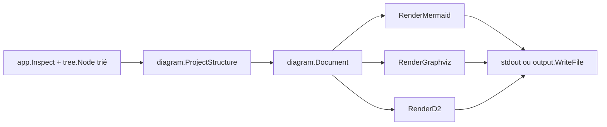

# Exports Mermaid, Graphviz et D2 — v0.2

## Évaluation et positionnement

Ce chantier ne se réduit pas à « trois nouveaux formats ». Le livrable architectural de v0.2 est **`diagram.Document`** : une projection canonique intermédiaire réutilisable par TUI, Desktop, MCP et futures vues (`dependencies`, `architecture`, etc.). Mermaid, DOT et D2 sont les **premiers consommateurs** de cette abstraction.

```text
                    ┌─ text
tree.Node ──────────┼─ markdown / markdown-tree
                    ├─ JSON
                    │
                    └─ diagram.ProjectStructure
                           │
                           ├─ Mermaid
                           ├─ Graphviz (DOT)
                           ├─ D2
                           │
                           ├─ future TUI
                           ├─ future Web/Desktop
                           └─ future MCP
```

Évolution ultérieure (hors périmètre v0.2) :

```text
filesystem tree
      ↓
analysis (structure, imports, modules, dependencies, architecture)
      ↓
diagram.Document { ContractVersion, View, Nodes, Edges }
      ↓
encodeurs / TUI / Desktop / MCP
```

`View` et `ContractVersion` évoluent sur des axes **distincts** (voir §2).

## Décisions verrouillées

- **`maxNodes: null` par défaut** ; warning non bloquant sur stderr à **500 nœuds** ; échec code 1 uniquement si l’utilisateur configure explicitement une limite (`--diagram-max-nodes` ou YAML) et la dépasse. Pas de troncature silencieuse.
- Livrer uniquement des **sources DSL** : Mermaid, DOT pour Graphviz et D2. Aucun SVG/PNG, exécutable externe ou moteur embarqué au runtime.
- Livrer d’abord la vue `structure`, limitée à la hiérarchie filesystem et aux relations `contains`. Ne pas inventer de dépendances architecturales absentes de `tree.Node`.
- Les trois formats sont canoniques, hors présentation terminal : aucun ANSI, thème, couleur, shape, classe ou icône Nerd/Unicode. Stabiliser d’abord topologie, identité, libellés, échappement et déterminisme ; le style sémantique viendra ensuite.
- Le symlink reste **terminal** : sa cible apparaît dans le libellé, jamais comme arête résolue (pas de cycles, I/O supplémentaire, sécurité cross-volume).
- Mermaid CLI, `dot` et D2 servent **uniquement en CI** pour valider la syntaxe ; ils ne entrent jamais dans le binaire Dirloom (single binary, offline, portable).
- Le développement part obligatoirement de `origin/release/v0.2.0` ; la PR cible `release/v0.2.0`, jamais `main`.

## Ordre d’implémentation — trois couches strictes

Le périmètre fonctionnel est large (catalogue, IR, trois encodeurs, YAML, CLI, diagnostics, fuzz, benchmarks, validation externe, ~12 documents, CI multi-plateforme). **Aucun encodeur Mermaid/DOT/D2 avant que la couche A soit stable et testée.**

### Couche A — Foundation (aucun encodeur)

```text
outputformat catalog (+ aliases)
       ↓
diagram.Document (ContractVersion, view, direction, nodes, edges)
       ↓
diagram.ProjectStructure(tree.Node) + validate
```

Livrables : catalogue centralisé, projection `structure` v1, IDs stables, invariants internes, frontière package `internal/diagram` (entrée projection / sortie `Document`), tests unitaires de projection — **sans** CLI diagramme ni goldens DSL.

### Couche B — Public feature

```text
diagram.Document
 ├── RenderMermaid(doc, w)
 ├── RenderGraphviz(doc, w)
 └── RenderD2(doc, w)

+ --format mermaid|graphviz|d2 (+ alias dot)
+ YAML diagram.*
+ config explain / provenance
```

Livrables : factory render, flags CLI, schéma config, messages d’usage, goldens de base sur le même `Document`.

### Couche C — Hardening

```text
hostile corpus
fuzz (échappeurs)
benchmark O(n)
official parsers (CI Linux)
documentation tests
docs synchronisées
cross-platform regression
```

Livrables : job CI `Diagram syntax compatibility`, fuzz, benchmarks, matrice hostile complète, publication `docs/graph-exports.md` et guides associés.

Commits logiques alignés sur ces couches :

1. `refactor(format): centralize output format capabilities`
2. `feat(diagram): add canonical structure graph projection`
3. `feat(render): add Mermaid Graphviz and D2 encoders`
4. `feat(cli): expose deterministic diagram export controls`
5. `test(diagram): validate DSL contracts and upstream parsers`
6. `docs(export): publish graphical export contracts`

## Architecture cible



### Invariant architectural (non négociable)

**Aucun encodeur diagramme reçoit directement `tree.Node`.** La duplication topologique entre dialectes devient alors pratiquement impossible.

```go
func RenderMermaid(doc diagram.Document, w io.Writer) error
func RenderGraphviz(doc diagram.Document, w io.Writer) error
func RenderD2(doc diagram.Document, w io.Writer) error

// Interdit :
func RenderMermaid(root *tree.Node, ...)
```

Test de parité obligatoire : les trois encodeurs reçoivent **exactement le même** `diagram.Document` et conservent le même nombre et ordre de nœuds et relations.

### 1. Catalogue central des formats

Créer [`internal/outputformat/catalog.go`](F:/SmartPE/win-projects/dirloom/internal/outputformat/catalog.go) pour supprimer les enums/messages dupliqués entre render, config, CLI et présentation.

Chaque descripteur expose :

```go
type Descriptor struct {
    Name       string   // nom canonique public
    Aliases    []string // alias acceptés (sans inférence depuis extension)
    Family     Family   // text, document, machine, diagram
    Extensions []string // extensions conseillées, informatives
    UsesStyle  bool
    UsesPresentation bool
}
```

API minimale : `Lookup`, `Names`, `Expected`, `IsDiagram`, `UsesStyle`, `UsesPresentation`.

Ordre public stable : `text`, `markdown`, `markdown-tree`, `json`, `mermaid`, `graphviz`, `d2`.

**Nommage Graphviz / DOT** :

| Aspect | Valeur |
| --- | --- |
| Nom canonique | `graphviz` |
| Alias accepté | `dot` |
| Extensions conseillées | `.dot`, `.gv` |

`--format graphviz` reste le nom utilisateur principal ; `--format dot` est un alias via le catalogue. L’extension de sortie ne doit **jamais** inférer le format.

Migrer les validations de [`internal/render/renderer.go`](F:/SmartPE/win-projects/dirloom/internal/render/renderer.go), [`internal/config/types.go`](F:/SmartPE/win-projects/dirloom/internal/config/types.go), [`internal/config/document.go`](F:/SmartPE/win-projects/dirloom/internal/config/document.go), [`internal/config/loader.go`](F:/SmartPE/win-projects/dirloom/internal/config/loader.go), [`internal/config/diagnostic.go`](F:/SmartPE/win-projects/dirloom/internal/config/diagnostic.go), [`internal/cli/root.go`](F:/SmartPE/win-projects/dirloom/internal/cli/root.go), [`internal/cli/theme.go`](F:/SmartPE/win-projects/dirloom/internal/cli/theme.go) et [`internal/presentation/capabilities.go`](F:/SmartPE/win-projects/dirloom/internal/presentation/capabilities.go) vers ce catalogue.

### 2. Projection de graphe canonique réutilisable

Créer un package indépendant [`internal/diagram`](F:/SmartPE/win-projects/dirloom/internal/diagram), importé par les renderers et réutilisable plus tard par TUI/Desktop/MCP.

**Frontière de package** (discipline v0.2, direction long terme) :

```text
┌─ entrée projection (thin adapter) ─┐
│  ProjectStructure(*tree.Node)      │  ← seul point d’import tree
└────────────────────────────────────┘
              ↓
┌─ modèle interne (sans tree) ───────┐
│  Document, Node, Edge, View, …     │  ← encodeurs, TUI, MCP ne voient que ceci
└────────────────────────────────────┘
```

- `internal/diagram` ne connaît `tree` que via **un adaptateur minimal** (`project_structure.go`) ; le reste du package (types, validate, id) ne dépend pas de `tree`.
- Les encodeurs et futurs consommateurs (TUI, Desktop, MCP) importent uniquement `diagram.Document` — jamais `tree.Node`.

Fichiers :

- `types.go` : `Document`, `Node`, `Edge`, `NodeKind`, `Relation`, `View`, `Direction`, `Options` ;
- `project_structure.go` : parcours itératif préordre unique de l’arbre déjà filtré/trié → `Document` ;
- `id.go` : identifiants sûrs et stables ;
- `validate.go` : invariants internes et budget de nœuds.

**`ContractVersion` dans le modèle** (pas seulement dans les commentaires des fichiers générés) :

```go
type Document struct {
    ContractVersion int // forme et invariants du contrat Document
    View            View // axe produit : structure, imports, dependencies, …
    Direction       Direction
    Nodes           []Node
    Edges           []Edge
}
```

**`ContractVersion` ≠ versioning des vues.** `ContractVersion` n’augmente que lorsqu’un changement **incompatible** est introduit dans la structure ou les invariants de `Document` (champs supprimés, sémantique d’arête modifiée, ordre canonique cassé, etc.). Une nouvelle `View` (`imports`, `dependencies`) peut être ajoutée **sans** incrémenter `ContractVersion` si la forme de `Document` reste compatible :

```text
ContractVersion 1
├── View: structure   (v0.2)
├── View: imports     (futur, même ContractVersion si compatible)
└── View: dependencies (futur, même ContractVersion si compatible)

ContractVersion 2   ← uniquement si rupture incompatible du contrat Document
```

Les fichiers DSL émis portent aussi un commentaire stable : `dirloom-diagram-contract: 1`, `view: structure`, `direction`, sans timestamp ni version du binaire.

Contrat `structure` v1 :

- un nœud IR par `tree.Node` ;
- une arête `contains` par relation parent-enfant ;
- racine toujours présente ; dossiers vides conservés ; symlinks terminaux ;
- la cible d’un symlink reste dans son libellé et ne devient jamais une arête résolue ;
- aucun chemin absolu, accès filesystem, classification sémantique ou relation inférée ;
- ordre des nœuds/arêtes dérivé du modèle canonique, indépendant de la plateforme et de la locale.

Identifiants : `n_root` pour la racine, puis `n_<sha256-128>` calculé sur `type + NUL + chemin relatif`. Déterministes, indépendants du DSL, ne révèlent pas directement le chemin, limitent les diffs lors d’insertion d’un frère. Détecter une collision et échouer avant toute écriture.

Libellés accessibles : dossier avec `/`, fichier avec son nom, symlink avec `name -> target` ou `name [symlink]`. Le type doit rester compréhensible sans couleur.

### 3. Options de diagramme extensibles

Étendre la configuration v1 pré-release avec :

```yaml
diagram:
  view: structure
  direction: top-down
  maxNodes: null   # défaut verrouillé : illimité
```

- `view` : uniquement `structure` pour ce jalon, enum extensible ;
- `direction` : `top-down` ou `left-right` ;
- `maxNodes` : entier positif ou `null` pour illimité ; **défaut `null`**.

Ajouter les flags `--diagram-view`, `--diagram-direction`, `--diagram-max-nodes`. Actifs uniquement pour les formats diagramme ; valeur CLI explicite avec un autre format → erreur d’usage code 2. Valeurs héritées inactives, visibles dans `config explain` avec provenance.

#### Politique `maxNodes` (verrouillée)

Alignée avec la philosophie Dirloom : scanner ce que l’utilisateur demande, produire un résultat déterministe — comme `--format json` sur un repo de 620 fichiers.

| Situation | Comportement |
| --- | --- |
| `maxNodes: null` (défaut) | Aucune limite moteur ; export toujours produit |
| ≥ 500 nœuds, limite non configurée | **Warning non bloquant** sur stderr ; recommande `--depth`, `--dirs-only`, `--ignore` |
| Limite explicite (CLI ou YAML) dépassée | **Échec code 1** ; stdout et destination existante intacts ; pas de troncature |

Le seuil de warning (500) est une constante documentée, non configurable en v0.2.

### 4. Trois encodeurs, une seule topologie

Créer :

- [`internal/render/mermaid.go`](F:/SmartPE/win-projects/dirloom/internal/render/mermaid.go) : sous-ensemble conservateur `flowchart TB|LR` ;
- [`internal/render/graphviz.go`](F:/SmartPE/win-projects/dirloom/internal/render/graphviz.go) : `strict digraph dirloom`, DOT brut, `rankdir=TB|LR` ;
- [`internal/render/d2.go`](F:/SmartPE/win-projects/dirloom/internal/render/d2.go) : `direction: down|right`.

Adapter la factory de [`internal/render/renderer.go`](F:/SmartPE/win-projects/dirloom/internal/render/renderer.go) : une seule invocation `diagram.ProjectStructure` → `Document`, puis délégation à l’encodeur. Les dialectes ne gèrent que l’en-tête, les nœuds, les arêtes et l’échappement lexical.

UTF-8 sans BOM, LF sur tous les OS, exactement un LF final.

### 5. Sécurité et échappement

Pas de pseudo-échappeur universel : **échappeurs spécifiques** Mermaid, DOT et D2. Toutes les données utilisateur restent confinées dans des labels quotés ; les IDs sont générés. Interdire directives Mermaid, attributs DOT actifs, HTML labels, URL/click, code D2, images ou Markdown provenant d’un nom de fichier.

Un nom comme :

```text
foo"]; click n_root "javascript:..."
```

ne doit jamais devenir autre chose qu’un label littéral.

Échappeurs dédiés :

- **Mermaid** : label double-quoté ; neutralisation guillemets, backslashes, HTML, backticks, retours et contrôles ;
- **DOT** : chaîne quotée ; protection `\N`, `\G`, `\E`, `\T`, `\H`, `\L`, retours et guillemets ; aucun HTML-like label ;
- **D2** : chaîne double-quotée ; backslashes/guillemets/retours neutralisés ; aucun bloc Markdown.

Matrice hostile obligatoire : ESC, bidi, CR/LF, NUL, backticks, séquences spéciales DOT, mots réservés (`end`, `graph`, `style`), noms non latins. Contrôles Unicode rendus sous forme textuelle sûre sans normaliser NFC/NFD.

### 6. Interactions CLI et invariants

Commandes publiques :

```bash
dirloom --format mermaid
dirloom --format graphviz   # alias : --format dot
dirloom --format d2
```

Pour `mermaid`, `graphviz`, `d2` :

- `--style` explicite rejeté ;
- `--color` actif, `--icons` actif ou `--theme` explicite rejetés ; `never` reste accepté ;
- préférences héritées de présentation/style inactives dans `config explain` ;
- filtres, `.gitignore`, hidden, profondeur, dirs-only et presets continuent d’agir avant projection ;
- `--output` reste transactionnel et auto-exclu ; stdout et fichier sont byte-for-byte identiques ;
- `.mmd`, `.dot`, `.gv` ou `.d2` ne déclenchent aucune inférence de format.

Ne modifier ni [`internal/tree`](F:/SmartPE/win-projects/dirloom/internal/tree), ni [`internal/app`](F:/SmartPE/win-projects/dirloom/internal/app), ni [`internal/filter`](F:/SmartPE/win-projects/dirloom/internal/filter), ni [`internal/output`](F:/SmartPE/win-projects/dirloom/internal/output).

## Stratégie de tests

### Unitaires et contractuels (couche A + B)

- Catalogue : unicité, ordre, capacités, alias `dot` → `graphviz`, message `expected` stable.
- Projection : racine seule, profondeur 0, dossiers vides, noms identiques dans branches différentes, symlink avec/sans cible, Unicode non normalisé, ordre canonique, IDs stables après insertion d’un frère, collision simulée, `ContractVersion` présent.
- Budget : `null` par défaut ; warning stderr à 500 nœuds ; échec explicite si limite CLI/config explicite dépassée.
- Goldens dans [`internal/render/testdata`](F:/SmartPE/win-projects/dirloom/internal/render/testdata) pour Mermaid, Graphviz et D2 sur le même arbre.
- **Parité** : les trois encodeurs reçoivent le même `diagram.Document` ; invariant « aucun encodeur touche `tree.Node` » vérifié par structure de packages / signatures.
- Writer défaillant : propagation de l’erreur, aucune sortie partielle considérée comme succès.

### Hardening (couche C)

- Matrice hostile complète (quotes, slash/backslash, backticks, `[]{}<>`, `&`, séquences DOT, CR/LF/tab/NUL/ESC, bidi, mots réservés, noms non latins).
- Fuzz des trois échappeurs avec corpus hostile.
- Benchmark arbre large et profond : complexité O(n), sans concaténation quadratique.

### CLI/configuration/non-régression

Étendre [`internal/cli/root_test.go`](F:/SmartPE/win-projects/dirloom/internal/cli/root_test.go), [`internal/config/document_test.go`](F:/SmartPE/win-projects/dirloom/internal/config/document_test.go), [`internal/config/loader_test.go`](F:/SmartPE/win-projects/dirloom/internal/config/loader_test.go), [`internal/config/diagnostic_test.go`](F:/SmartPE/win-projects/dirloom/internal/config/diagnostic_test.go) et [`internal/render/render_test.go`](F:/SmartPE/win-projects/dirloom/internal/render/render_test.go) : aide, YAML, priorité/provenance, options incompatibles, code 1/2, stdout/fichier, destination préservée, absence d’inférence et sorties portables.

Rejouer explicitement les goldens texte, Markdown, Markdown Tree et le JSON schema v1 : **aucun octet existant ne change**.

### Validation des dialectes officiels (CI uniquement)

Job Linux bloquant `Diagram syntax compatibility` dans [`.github/workflows/ci.yml`](F:/SmartPE/win-projects/dirloom/.github/workflows/ci.yml). Versions épinglées depuis releases stables : Mermaid CLI, Graphviz `dot`, D2 CLI.

Le job génère les trois fixtures puis exécute `mmdc`, `dot -Tsvg` et `d2` vers un dossier temporaire. Les SVG servent uniquement de preuve de syntaxe — ni committés ni distribués.

## Documentation

Créer [`docs/graph-exports.md`](F:/SmartPE/win-projects/dirloom/docs/graph-exports.md) : contrat v1, `ContractVersion`, commandes, intégration Mermaid dans un README, utilisation DOT/D2, options vue/direction/budget (et philosophie `maxNodes`), alias `dot`, formats de fichiers conseillés, exemples réels, sécurité, symlinks, limites, absence de rendu image et absence de style en v0.2.

Mettre à jour dans la même PR :

- [`README.md`](F:/SmartPE/win-projects/dirloom/README.md) et l’aide CLI ;
- [`docs/configuration.md`](F:/SmartPE/win-projects/dirloom/docs/configuration.md), [`docs/use-cases.md`](F:/SmartPE/win-projects/dirloom/docs/use-cases.md), [`docs/architecture.md`](F:/SmartPE/win-projects/dirloom/docs/architecture.md), [`docs/dependencies.md`](F:/SmartPE/win-projects/dirloom/docs/dependencies.md) ;
- [`docs/themes.md`](F:/SmartPE/win-projects/dirloom/docs/themes.md) pour l’inactivité de la présentation ;
- [`docs/product/functional-specification.md`](F:/SmartPE/win-projects/dirloom/docs/product/functional-specification.md) §11.3 avec le contrat `structure` v1 ;
- [`docs/product/roadmap.md`](F:/SmartPE/win-projects/dirloom/docs/product/roadmap.md) §6.5 et le statut v0.2 ;
- [`docs/product/README.md`](F:/SmartPE/win-projects/dirloom/docs/product/README.md), [`CHANGELOG.md`](F:/SmartPE/win-projects/dirloom/CHANGELOG.md), [`CONTRIBUTING.md`](F:/SmartPE/win-projects/dirloom/CONTRIBUTING.md).

Les blocs documentaires marqués sont générés par les vrais renderers et comparés dans un `documentation_test.go`. Ne pas modifier `SPEC-v0.1.md`.

## GitOps et livraison v0.2

Précondition : ne rien développer sur d’anciennes branches feature ; exécuter depuis `feat/graph-exports` basée sur `origin/release/v0.2.0`.

Ouvrir tôt une PR draft **feat/graph-exports → release/v0.2.0**, titre prévu `feat(export): add deterministic Mermaid Graphviz and D2 formats`. Corps : objectif (`diagram.Document` + trois encodeurs), périmètre, risque medium-high, absence de migration/secret, tests, outils CI épinglés, rollback par revert du squash.

Passer ready uniquement après : CI Windows/Linux/macOS verte, race/lint/vuln verts, job compatibilité DSL vert, GoReleaser snapshot validé, conversations résolues et revue indépendante. Squash merge dans `release/v0.2.0`.

Cette PR ne fusionne pas `release/v0.2.0` vers `main`, ne crée pas `v0.2.0`, ne publie pas une release. Ces étapes restent au GO/NO-GO global de la RC selon le [hub GitOps](https://knowledge.floxio.ai/doc/guide-release-workflow-git-ops-hub-6ERj1DbE2s) et le [runbook release](https://knowledge.floxio.ai/doc/runbook-release-workflow-B3YkeIOyjw).

## Critères de sortie

- **`diagram.Document` stable** avec `ContractVersion`, projection `structure` v1 et tests de projection verts.
- Les trois commandes produisent des DSL valides, déterministes et hors ligne depuis le **même** `Document`.
- Aucun encodeur diagramme importe ou accepte `tree.Node` directement.
- Aucun nom utilisateur ne peut injecter de syntaxe active.
- Politique `maxNodes` : `null` défaut, warning à 500, échec si limite explicite dépassée ; pas de troncature silencieuse.
- Frontière `internal/diagram` : un seul adaptateur `tree` ; encodeurs et consommateurs futurs = `Document` only.
- Aucun changement byte-for-byte des formats existants.
- Alias `dot` accepté pour `graphviz` via le catalogue.
- Documentation et exemples exécutables synchronisés au code.
- PR mergée uniquement dans `release/v0.2.0`, avec preuves CI et revue indépendante.

## Checklist pré-merge (contrat public — toutes décisions figées)

| # | Décision | Statut |
| --- | --- | --- |
| 1 | `maxNodes: null` défaut + warning stderr à 500 + échec si limite explicite | Verrouillé |
| 2 | Alias `dot` pour `graphviz` dans le catalogue | Verrouillé |
| 3 | `ContractVersion` dans `diagram.Document` ; distinct du versioning des `View` | Verrouillé |
| 4 | Invariant : encodeurs = `Document` only ; `tree.Node` via adaptateur unique | Verrouillé |
| 5 | Aucun style/couleur/icône en v0.2 | Verrouillé |
| 6 | Symlinks terminaux, pas d’arête résolue | Verrouillé |

**Statut du plan : prêt pour exécution** (évaluation ~9,7/10) — aucune décision produit ouverte restante.
