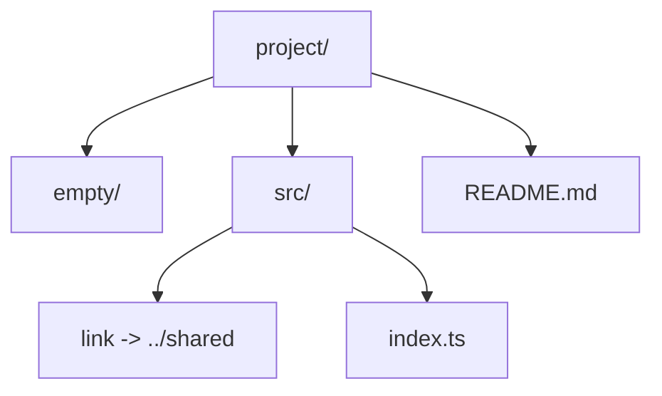
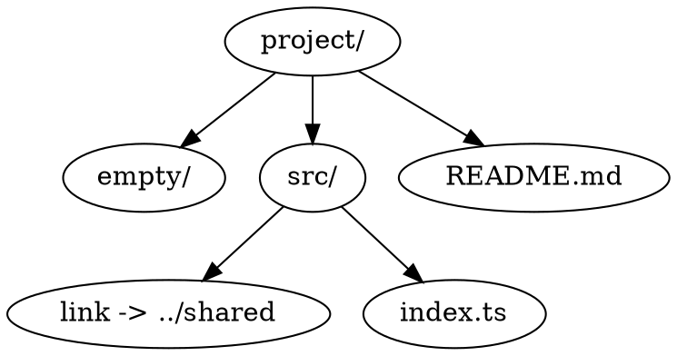

# Graphical exports

Dirloom can project the inspected tree into deterministic diagram sources for README files, architecture notes and reports. The public formats are Mermaid, Graphviz DOT and D2. Dirloom emits **DSL source only**: there is no image rendering, no bundled layout engine and no network call at runtime.

All three formats are canonical projections of the same `structure` view. They contain no ANSI, theme, icon, shape class or semantic coloring. Topology, stable identifiers, labels and escaping are the v0.2 contract; visual styling is intentionally out of scope.

## Quick start

```bash
dirloom --format mermaid
dirloom --format graphviz
dirloom --format d2
```

`--format dot` is an accepted alias for `--format graphviz`. The output file extension never selects a format: `dirloom --output structure.mmd` still writes the default `text` tree unless `--format mermaid` is set.

Write transactionally:

```bash
dirloom . --format mermaid --output docs/structure.mmd
dirloom . --format graphviz --output docs/structure.dot
dirloom . --format d2 --output docs/structure.d2
```

Suggested extensions are informative only: `.mmd` / `.mermaid` for Mermaid, `.dot` / `.gv` for Graphviz, and `.d2` for D2.

## Contract version and views

Every diagram document carries `ContractVersion` `1`. That number describes the shape and invariants of the intermediate graph, not the list of views. The only view in this release is `structure`. Later views such as `imports` or `dependencies` may reuse `ContractVersion` `1` when the document shape stays compatible.

Generated files start with a stable header and never include a timestamp or binary version:

```text
dirloom-diagram-contract: 1; view: structure; direction: top-down
```

The `structure` view contains:

- one node per inspected tree node, including empty directories;
- one `contains` edge per parent-child relation;
- the inspected root as `n_root`;
- symlink targets in the label only, never as a resolved edge.

Identifiers are `n_root` for the root and `n_<sha256-128>` derived from `type + NUL + relative path`. They are independent from the output dialect and remain stable when a sibling is inserted.

Labels stay readable without color: directories end with `/`, files keep their name, and a symlink uses `name -> target` or `name [symlink]`.

## Options

| Option | Values | Default | Meaning |
| --- | --- | --- | --- |
| `--diagram-view` | `structure` | `structure` | Select the graph projection. |
| `--diagram-direction` | `top-down`, `left-right` | `top-down` | Preferred flow. |
| `--diagram-max-nodes` | positive integer or `unlimited` | unlimited | Fail if the projected graph would exceed an explicit budget. |

These flags are active only for `mermaid`, `graphviz` and `d2`. An explicit diagram flag with another format is a usage error (`2`). Inherited YAML values remain visible in `dirloom config explain` and are reported as inactive.

Persistent configuration uses the same fields:

<!-- dirloom-graph-config:project -->
```yaml
schemaVersion: 1

defaults:
  format: mermaid

diagram:
  view: structure
  direction: left-right
  maxNodes: null
```

`maxNodes: null` is the locked default: Dirloom scans what was requested and always produces the full graph. When the graph has 500 or more nodes and no explicit limit is set, Dirloom writes a non-blocking warning to stderr and still succeeds. The 500-node threshold is documented and not configurable in v0.2.

An explicit CLI or YAML limit that is exceeded is a runtime error (`1`). Stdout stays empty, an existing `--output` destination is left untouched, and the graph is never truncated.

Inspection filters still apply before projection: `--depth`, `--dirs-only`, `--hidden`, `--ignore`, `.gitignore` and presets change the tree, then the diagram is derived from that tree.

## Mermaid

Paste the source into a GitHub README or any Mermaid-capable renderer:

<!-- dirloom-graph-command:mermaid -->
```bash
dirloom --format mermaid
```

Given the same sample tree used by the other public format guides, Dirloom emits:

<!-- dirloom-graph-output:mermaid -->


`--diagram-direction left-right` selects `flowchart LR`.

## Graphviz

Use Graphviz `dot` when a local layout engine is available. Dirloom does not invoke `dot`.

```bash
dirloom --format graphviz --output structure.dot
dot -Tsvg structure.dot -o structure.svg
```

<!-- dirloom-graph-output:graphviz -->


## D2

```bash
dirloom --format d2 --output structure.d2
d2 structure.d2 structure.svg
```

<!-- dirloom-graph-output:d2 -->
```d2
# dirloom-diagram-contract: 1; view: structure; direction: top-down
direction: down
n_root: "project/"
n_e0bfc4055d108470c31075a1d817fe54: "empty/"
n_64b2cdb21b87ca363f9c4f912dd9b856: "src/"
n_fdb45ec835624d3a17b5bac915a25ed6: "link -> ../shared"
n_1288e17cf5fc31d3297c21327237d5b3: "index.ts"
n_a451623ea511a512c23c810fe86e25a0: "README.md"
n_root -> n_e0bfc4055d108470c31075a1d817fe54
n_root -> n_64b2cdb21b87ca363f9c4f912dd9b856
n_64b2cdb21b87ca363f9c4f912dd9b856 -> n_fdb45ec835624d3a17b5bac915a25ed6
n_64b2cdb21b87ca363f9c4f912dd9b856 -> n_1288e17cf5fc31d3297c21327237d5b3
n_root -> n_a451623ea511a512c23c810fe86e25a0
```

## Presentation and style

`--style`, active `--color`, active `--icons` and every explicit `--theme` are rejected with diagram formats. `--color never` and `--icons never` remain valid for hermetic scripts. Inherited presentation values are inactive in `config explain`.

## Security

User-controlled names stay inside quoted labels. Node identifiers are generated and never copied from a filename. A name such as:

```text
foo"]; click n_root "javascript:..."
```

is rendered as a literal label. Mermaid directives, Graphviz HTML labels, URL/click attributes, D2 markdown blocks and images cannot be injected from the filesystem.

Control, line-break and bidirectional characters are written as visible escapes. Unicode is not normalized, so `é` and `e\u0301` remain distinct.

Symlinks are terminal. Dirloom never follows a symlink target to create an extra edge, which avoids cycles, extra I/O and cross-volume resolution.

## Limits

- Only the `structure` view exists in v0.2. Dirloom does not invent import, module or architecture edges.
- The three formats are sources. Rendering SVG or PNG is an external step and is not shipped in the Dirloom binary.
- Official parsers (Mermaid CLI, Graphviz `dot`, D2) are used in CI to prove syntax. They are never bundled.
- Output is UTF-8 without a BOM, uses LF on every platform and ends with exactly one LF.
- Stdout and `--output` are byte-for-byte identical for the same inspection.
