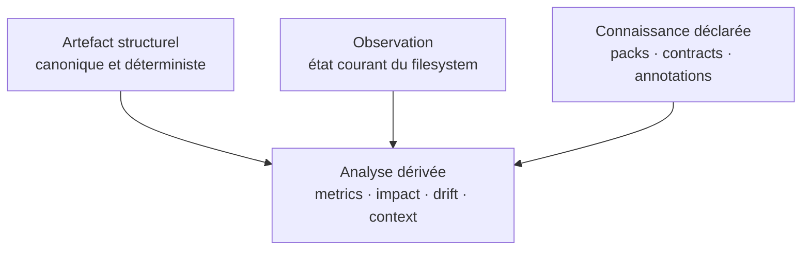

# Spécification fonctionnelle transversale

> **Statut :** contrat fonctionnel cible, à décliner par version<br>
> **Socle observé :** `v0.1.1`<br>
> **Autorité :** ce document ne remplace pas les spécifications de versions publiées<br>
> **Public :** produit, design, engineering et QA

## 1. Objet

Cette spécification décrit comment Dirloom doit évoluer d'un générateur d'arborescence déterministe vers une plateforme locale d'intelligence structurelle. Elle fixe les concepts communs, les parcours attendus, les exigences transversales et les frontières entre capacités.

Les exemples de commandes rendent l'expérience cible concrète. Leur syntaxe reste provisoire jusqu'à acceptation d'une spécification de version.

## 2. Langage normatif

- **DOIT** / **NE DOIT PAS** : exigence nécessaire pour considérer la capacité conforme ;
- **DEVRAIT** / **NE DEVRAIT PAS** : comportement attendu, sauf justification documentée ;
- **PEUT** : possibilité compatible mais non obligatoire.

## 3. Modèle fonctionnel commun

### 3.1 Les quatre couches de données

Dirloom DOIT distinguer les informations selon leur origine et leur stabilité.



| Couche | Exemples | Règle |
| --- | --- | --- |
| Artefact structurel | nom, type, hiérarchie, ordre, options pertinentes, version de schéma | Déterministe et fingerprintable |
| Observation | taille, date, permissions, propriétaire, état Git | Explicitement demandée ; non canonique par défaut |
| Connaissance déclarée | Architecture Pack, contract, annotation, topologie voulue | Versionnée et attribuable à une source |
| Analyse dérivée | métrique, conformité, impact, dérive, sélection de contexte | Méthode et inputs identifiables |

Une donnée d'observation NE DOIT PAS entrer silencieusement dans le fingerprint structurel. Une analyse DOIT indiquer si elle repose uniquement sur l'artefact ou aussi sur des observations, du contenu, des dépendances ou un modèle externe.

### 3.2 Identité et version

Tout artefact persistant DOIT contenir ou référencer :

- son type ;
- sa version de schéma ;
- les options qui affectent son sens ;
- son algorithme de canonicalisation lorsqu'il est fingerprinté ;
- sa compatibilité de lecture ;
- sa provenance lorsque celle-ci est disponible sans exposer de secret.

Dirloom NE DOIT PAS accepter silencieusement un schéma incompatible. Il DOIT soit le migrer explicitement, soit expliquer la version supportée et l'action attendue.

### 3.3 Projection et enrichissement

Les rendus texte, Markdown clôturé, Markdown sémantique, JSON, TUI, Desktop, Mermaid, Graphviz et D2 sont des projections. Une projection PEUT cacher, regrouper ou enrichir des informations, mais elle NE DOIT PAS modifier le modèle source.

Le format Markdown sémantique `markdown-tree` DOIT rester distinct du format `markdown` historique : il exprime chaque nœud comme un élément de liste imbriqué, sans ANSI, thème, icône terminal, HTML ni lien implicite. Son échappement PEUT modifier la représentation visible d'un caractère dangereux, mais NE DOIT ni renommer le nœud dans le modèle, ni modifier les autres formats.

Les transformations visuelles — couleur, icône, indentation, badge, regroupement — NE DOIVENT PAS changer :

- l'ordre canonique ;
- l'identité d'un nœud ;
- un fingerprint ;
- la conformité d'un contrat ;
- le contenu d'un snapshot.

## 4. Exigences transversales

### 4.1 Plateformes et surfaces

Les capacités du cœur DOIVENT rester accessibles sous Windows, Linux et macOS. La CLI reste la surface normative. Les TUI, Desktop, skills, MCP et IDE DOIVENT appeler les mêmes services applicatifs ou contrats publics.

### 4.2 Localité et confidentialité

- Capturer, rendre, comparer, requêter et vérifier DOIT fonctionner hors ligne.
- Aucun fichier ni artefact NE DOIT être envoyé sur le réseau par défaut.
- Toute capacité réseau future DOIT afficher sa destination, sa portée et la nature des données transmises.
- Les logs, rapports et erreurs NE DOIVENT PAS exposer de chemins absolus ou de secrets sans nécessité explicite.

### 4.3 Sorties machines

Les commandes utilisables en automatisation DOIVENT proposer :

- un format machine versionné ;
- des codes de sortie documentés ;
- une séparation stdout/stderr stable ;
- une option pour désactiver toute décoration ;
- des résultats sans interaction en environnement non interactif ;
- un diagnostic actionnable en cas d'échec.

### 4.4 Accessibilité

Une information de statut NE DOIT PAS dépendre uniquement d'une couleur ou d'une icône. Les contrastes des thèmes fournis DEVRAIENT respecter les usages accessibles des terminaux et des surfaces graphiques. Un mode sans couleur ni police spéciale DOIT rester complet.

### 4.5 Budget de performance

Chaque capacité DOIT déclarer son niveau de coût :

| Classe | Lecture permise | Exemple |
| --- | --- | --- |
| P0 | Métadonnées de structure uniquement | inspect, snapshot structurel |
| P1 | Métadonnées d'observation | taille, mtime, permissions |
| P2 | Contenu ciblé | fingerprint de contenu, imports |
| P3 | Analyse large ou index | impact, symboles, contexte orienté tâche |

La classe active et la portée DEVRAIENT être visibles avant une opération coûteuse ou sensible.

## 5. Expérience visuelle : couleurs, icônes et thèmes

### 5.1 Objectif

Dirloom DOIT fournir un système de présentation suffisamment expressif pour distinguer types de nœuds, fichiers remarquables, extensions, états de diff, sévérités, conformité et annotations dans le terminal, le TUI et Desktop.

La référence à eza exprime un niveau d'ambition : activation contrôlable, thèmes personnalisables, couleurs et icônes par catégorie, compatibilité avec `NO_COLOR` et réglage de l'espacement. Dirloom conserve sa propre sémantique centrée sur l'architecture.

### 5.2 Modes d'activation

Expérience cible :

```bash
dirloom --color auto --icons nerd
dirloom --color always --icons never
dirloom --theme midnight
```

Les couleurs DOIVENT supporter `never`, `always` et `auto`. Les icônes DOIVENT supporter `never`, `unicode`, `nerd` et `auto`. Afin de préserver le contrat historique, le profil par défaut de la commande scriptable DEVRAIT rester non décoré tant qu'une décision de version n'a pas explicitement modifié ce contrat. Un preset interactif PEUT activer `auto`.

- `never` n'émet aucune séquence ANSI ni icône décorative ;
- `auto` active la décoration seulement sur une surface compatible ;
- `always` force la projection, y compris dans une redirection explicitement voulue ;
- `unicode` sélectionne un jeu portable sans dépendance à Nerd Font ;
- `nerd` sélectionne le jeu enrichi et DOIT conserver un fallback configurable ;
- `NO_COLOR` DOIT désactiver la couleur sauf si une option CLI explicite et documentée a priorité ;
- les formats JSON canoniques NE DOIVENT jamais contenir d'ANSI ou d'icône de présentation.

### 5.3 Tokens sémantiques

Le thème DOIT cibler des rôles stables, et non des positions d'écran :

```text
tree.edge
node.directory
node.file
node.symlink
node.generated
node.hidden
state.added
state.removed
state.moved
state.changed
status.pass
status.warn
status.fail
severity.low
severity.medium
severity.high
annotation.owner
annotation.deprecated
```

La liste PEUT évoluer avec une version de thème. Un token inconnu DOIT être ignoré avec un avertissement en mode validation, sans faire échouer une simple inspection si un fallback existe.

### 5.4 Résolution des règles

Pour les noms et icônes, la priorité cible est :

```text
chemin exact
  > nom exact
  > motif de chemin
  > extension
  > type de nœud
  > fallback
```

Les états fonctionnels — erreur, ajout, suppression, dérive — s'appliquent comme une couche sémantique distincte et prioritaire. La résolution DOIT être documentée et déterministe.

Exemple exploratoire :

```yaml
schemaVersion: 1
name: midnight

palette:
  directory: "#7AA2F7"
  warning: "#E0AF68"
  danger: "#F7768E"

tokens:
  node.directory:
    color: directory
    icon: "󰉋"
  state.moved:
    color: warning
    icon: "→"
  status.fail:
    color: danger
    style: bold

rules:
  - match: { name: "README.md" }
    icon: "󰂺"
  - match: { extension: ".go" }
    icon: ""

icons:
  spacing: 1
  fallback: "·"
```

### 5.5 Validation et fallback

Dirloom DOIT pouvoir valider un thème sans lancer une inspection complète. Il DOIT signaler : token inconnu, couleur invalide, règle inaccessible, icône vide, collision non déterministe et version incompatible.

Si la police ne rend pas une icône correctement, l'utilisateur DOIT pouvoir choisir un jeu ASCII/Unicode portable. L'alignement NE DOIT PAS supposer qu'un glyphe occupe toujours une cellule ; l'espacement doit être configurable.

### 5.6 Critères d'acceptation

- La même structure sans décoration conserve le même ordre et le même JSON qu'avant l'activation d'un thème.
- Un thème peut différencier au minimum dossiers, fichiers, symlinks, extensions, états de diff et sévérités de contrat.
- `NO_COLOR` et les trois modes sont couverts par des tests TTY et non-TTY.
- Un thème invalide produit un diagnostic localisé et ne corrompt aucune sortie.
- Les thèmes fournis restent lisibles en thème clair, sombre et sans couleur.
- La licence et la provenance de chaque jeu d'icônes embarqué sont documentées ; aucun thème n'est téléchargé implicitement.

## 6. Structural Version Control

### 6.1 Fingerprint

Expérience cible :

```bash
dirloom fingerprint
```

Sortie conceptuelle :

```text
dlm:v1:sha256:8e5b…
```

Le fingerprint structurel DOIT dériver d'une représentation canonique contenant les noms normalisés selon le contrat Dirloom, les types, la hiérarchie, l'ordre, les options pertinentes et la version d'algorithme. Il NE DOIT PAS inclure timestamps, permissions ou chemins absolus par défaut.

Des namespaces distincts DOIVENT empêcher la confusion entre empreintes :

```text
structureFingerprint
contentFingerprint
dependencyFingerprint
architectureFingerprint
contextFingerprint
```

### 6.2 Snapshot

Expérience cible :

```bash
dirloom snapshot --output architecture.dlm.json
```

Un snapshot DOIT être autonome, versionné, comparable et dépourvu de métadonnées sensibles par défaut. Il DOIT enregistrer les options qui déterminent sa portée. Un snapshot décrit un état précis ; il n'exprime pas une règle générale.

### 6.3 Verify

```bash
dirloom verify architecture.dlm.json
```

`verify` DOIT répondre à la question : « la structure observée correspond-elle encore à cet état de référence selon le mode demandé ? »

Le résultat DOIT distinguer :

- correspondance ;
- différence structurelle ;
- artefact incompatible ;
- observation impossible ;
- portée ou options non comparables.

### 6.4 Diff

```bash
dirloom diff architecture.dlm.json .
```

Le diff DOIT représenter au minimum les ajouts, suppressions et changements de type. La détection de déplacement DOIT être graduelle :

1. chemin, basename et forme du sous-arbre ;
2. métadonnées optionnelles ;
3. fingerprint de contenu optionnel ;
4. identité sémantique future.

Une correspondance heuristique DOIT afficher son niveau de confiance. Elle NE DOIT PAS transformer un ajout/suppression certain en déplacement certain sans preuve suffisante.

Exemple :

```text
MOVED  src/internal/parser/
    →  src/core/parsing/
confidence: high (identical subtree shape)
```

### 6.5 History

L'historique PEUT comparer des snapshots versionnés ou des états Git. Il DOIT distinguer l'historique structurel calculé des snapshots explicitement conservés. `watch` peut accélérer la détection, mais ne constitue pas la source unique de vérité.

### 6.6 Critères d'acceptation

- Deux plateformes produisent le même fingerprint pour des inputs canoniquement identiques.
- `verify` et `check` ne sont jamais présentés comme synonymes.
- Un diff peut être rendu en texte et dans un format machine versionné.
- L'absence de preuve suffisante conserve un changement sous forme ajout/suppression ou mouvement probable.
- Les artefacts incompatibles échouent avec une instruction de migration ou de régénération.

## 7. Requêtes, métriques et formes

### 7.1 Query

Expériences cibles :

```bash
dirloom query 'dirs where depth > 6'
dirloom query 'files where extension == ".go"'
dirloom query --observe 'files where size > 100kb'
```

Le langage de requête DOIT être documenté, versionné et identique entre CLI, TUI, Desktop et MCP. Une requête canonique NE DOIT accéder qu'aux champs déterministes. L'accès à une observation DOIT exiger un mode explicite ou une source explicitement qualifiée.

Le résultat DOIT pouvoir indiquer : champ inconnu, type incompatible, syntaxe invalide, capacité d'observation manquante et portée vide.

### 7.2 Metrics

```bash
dirloom metrics
```

Les métriques initiales DEVRAIENT rester descriptives : nombres de nœuds, profondeur, fan-out, concentration, distribution et croissance entre deux artefacts. Une heuristique DOIT publier son nom et sa méthode.

Exemple :

```text
Structure Health

Directories             184
Files                   971
Maximum depth            11
Median depth              5

Highest fan-out
src/shared/              48

Observation
Top 5 directories contain 63% of files
```

Le titre « Structure Health » ne doit pas faire passer les observations pour un diagnostic médical de l'architecture. Une formulation comme « Structural observations » DEVRAIT être préférée tant que le produit n'applique pas de contrat explicite.

### 7.3 Structural Shape Diff

```bash
dirloom shape compare 'services/*'
```

La comparaison de forme DOIT :

- sélectionner un ensemble comparable ;
- expliquer la forme de référence — Shape Signature, Architecture Pack, contract, dominant statistique ou nœud choisi ;
- distinguer manquants, supplémentaires, renommages probables et exceptions déclarées ;
- éviter un pourcentage sans détail actionnable ;
- produire une sortie machine consommable par la CI.

Exemple :

```text
Structural conformity — reference: dominant shape

billing    100%
orders      96%
users       41%

users differs:
  missing:     domain/ application/ infrastructure/
  additional:  controllers/ services/ repositories/
```

### 7.4 Critères d'acceptation

- Une même requête canonique produit le même ensemble ordonné sur les plateformes supportées.
- Les champs d'observation sont impossibles à utiliser silencieusement dans une requête canonique.
- Chaque métrique est définie et testable sur une fixture minimale.
- Un score de conformité renvoie toujours vers les écarts qui l'expliquent.

## 8. Architecture Generation : Scaffold, Templates & Packs

### 8.1 Ambition

Dirloom vise un moteur de génération capable de couvrir les besoins qui conduisent aujourd'hui à des outils comme Cookiecutter ou Yeoman : prompts, variables typées, valeurs par défaut, validation, variantes, chemins paramétrés, fichiers de contenu, conditionnels, répétitions contrôlées, valeurs calculées simples et composition. Sa différenciation est la boucle complète :

```text
Architecture Pack → template → plan → scaffold → check
                  → shape compare → snapshot → drift → migration
```

### 8.2 Template

Un template décrit une unité matérialisable à l'intérieur d'un pack. Il DOIT pouvoir déclarer :

- inputs, types, prompts, valeurs par défaut et validations ;
- chemins et conventions de nommage ;
- dossiers, fichiers, stubs et fichiers facultatifs ;
- conditions, répétitions contrôlées et variantes ;
- valeurs calculées simples et composition d'autres templates ;
- actions mutantes, permissions et stratégies de conflit.

### 8.3 Architecture Pack

Un Architecture Pack est l'unité versionnée qui transforme une convention en système installable, vérifiable, génératif et exploitable par les agents. Il PEUT réunir :

```text
Architecture Pack
├── templates
├── variants
├── structural contracts
├── naming rules
├── annotation defaults
├── Shape Signatures
├── query presets
├── context rules
├── visual metadata
├── migrations
└── agent skills
```

Le manifest DOIT déclarer l'identité, la version, la compatibilité Dirloom, la provenance, l'intégrité, les permissions et les hooks éventuels.

Exemple exploratoire :

```yaml
packVersion: 1
id: reference-fsd
version: 0.1.0

templates:
  feature:
    inputs:
      name:
        type: identifier
        required: true
      variant:
        type: enum
        values: [flutter, nextjs, hono]
    structure:
      - path: "features/{{ name }}"
        use: "variants/{{ variant }}"

contracts:
  - "contracts/{{ variant }}.yaml"

permissions:
  filesystem:
    createWithin: "{{ destination }}"
  commands: []
  network: false
```

Cet exemple NE définit PAS encore la forme réelle de l'architecture de référence. Celle-ci doit être capturée à partir des trois projets réels avant de figer le pack.

### 8.4 Plan, dry-run et apply

```bash
dirloom scaffold feature payments \
  --pack reference-fsd \
  --variant nextjs \
  --dry-run
```

Avant toute mutation, Dirloom DOIT produire ou pouvoir produire un plan contenant :

- pack, template, variante et provenance résolus ;
- destination et chemins validés ;
- dossiers et fichiers créés ou modifiés ;
- conflits, écrasements et stratégie choisie ;
- variables résolues, hors secrets ;
- contracts et Shape Signatures évaluables ;
- commandes, hooks ou accès réseau demandés ;
- limites transactionnelles et stratégie de rollback.

Le workflow PEUT aussi exposer des commandes séparées :

```bash
dirloom scaffold plan ...
dirloom scaffold apply <plan>
```

### 8.5 Matérialisation

L'exécution DOIT refuser toute sortie du workspace autorisé. Elle DOIT être transactionnelle dans la mesure permise par le filesystem. Si une transaction globale n'est pas possible, Dirloom DOIT produire un rapport et expliquer les limites de rollback avant l'action.

Par défaut, Dirloom NE DOIT PAS écraser un fichier existant. Les stratégies possibles — fail, skip, merge, overwrite — DOIVENT être explicites et limitées aux fichiers concernés. `overwrite all` NE DOIT PAS devenir un fallback implicite.

### 8.6 Templates de contenu

Le moteur PEUT rendre des fichiers texte, pas seulement des dossiers. Il DOIT alors :

- préserver l'encodage et les fins de ligne déclarés ;
- échapper ou valider les variables selon leur contexte ;
- interdire l'accès implicite à des variables d'environnement sensibles ;
- produire un diff avant de modifier un fichier existant ;
- distinguer copie statique, rendu de template et patch déclaratif.

### 8.7 Hooks et installations

Pour concurrencer de vrais moteurs de scaffolding, Dirloom PEUT supporter des hooks ou installations. Aucun hook NE DOIT s'exécuter silencieusement. Il DOIT déclarer : commande exacte, répertoire de travail, variables visibles, réseau requis, fichiers accessibles, plateformes supportées, moment d'exécution et stratégie d'échec.

Les permissions, la provenance et la signature éventuelle DOIVENT être visibles. Une désactivation globale DOIT être possible. Un pack téléchargé NE DOIT jamais exécuter un hook lors de sa simple inspection ou validation.

### 8.8 Premier Architecture Pack de référence

Le pack provisoire `reference-fsd` est considéré « supporté à 100 % » seulement si :

1. les invariants communs de l'architecture sont documentés ;
2. les variantes Flutter, Next.js et Hono.js sont encodées sans duplication incontrôlée ;
3. les entrées et règles de nommage sont validées ;
4. le dry-run montre la structure, les contenus, les permissions et la provenance ;
5. la génération est idempotente ou son conflit est expliqué ;
6. les contracts associés passent immédiatement après génération ;
7. `dirloom shape compare` reconnaît les instances générées ;
8. snapshot et diff représentent fidèlement une évolution du pack ;
9. une migration de pack est testée sur au moins une fixture par stack ;
10. les query presets, règles de contexte et skills déclarés utilisent le même pack ;
11. les scénarios Windows, Linux et macOS sont couverts.

### 8.9 Capture Template

```bash
dirloom template capture ./src/features/auth
```

La capture DOIT dériver un template candidat d'une structure réelle, puis demander à l'utilisateur de confirmer ou corriger les variables, invariants et éléments facultatifs détectés. Elle NE DOIT PAS transformer une heuristique en convention certaine sans validation.

### 8.10 Migrations de packs

```bash
dirloom pack upgrade reference-fsd
dirloom migrate --from reference-fsd@1 --to reference-fsd@2
```

Une migration DOIT reconnaître la Shape Signature de départ, produire un plan, mesurer l'écart, appliquer les règles de sécurité mutante et vérifier la cible. Le pack vivant doit pouvoir faire évoluer les instances générées, pas seulement créer de nouveaux projets.

### 8.11 Registry

```bash
dirloom pack search flutter
dirloom pack install org/reference-fsd
dirloom pack update
```

Le registry DOIT distinguer les catégories `official`, `verified`, `community` et `private`. Avant une ouverture publique, le format, la compatibilité, les checksums, la provenance, les permissions, les hooks et les signatures lorsque pertinentes DOIVENT être stabilisés. L'inspection d'un pack reste possible sans exécution.

## 9. Architecture Contracts et gouvernance

### 9.1 Contracts

```bash
dirloom check
```

Un contrat répond à la question : « la structure respecte-t-elle les règles autorisées ? » Il est distinct d'un snapshot, qui demande : « la structure est-elle toujours exactement celle-ci ? »

Le premier langage de contrats DEVRAIT couvrir :

- éléments requis et interdits ;
- motifs de modules ;
- profondeur et fan-out ;
- conventions de nommage ;
- cardinalité ;
- formes attendues ;
- exceptions localisées et justifiées.

Exemple exploratoire :

```yaml
schemaVersion: 1

contracts:
  - name: feature-shape
    match: "src/features/*"
    require:
      - "index.ts"
      - "*.types.ts"
    forbid:
      - "internal/**/public.*"
    limits:
      maxDepth: 7
```

Les règles de dépendances viendront comme extension explicite lorsque Dirloom disposera d'une couche d'analyse de contenu ou d'adaptateurs de langage. Elles NE DOIVENT PAS être simulées à partir de la seule proximité des dossiers.

### 9.2 Severities, diagnostics et explain

Les severities publiques sont `info`, `warning` et `error`. Chaque violation DOIT fournir :

- identifiant de règle ;
- severity ;
- emplacement ;
- valeur observée ;
- valeur attendue ;
- source du contract ;
- exception applicable ou non ;
- correction possible lorsque celle-ci est sûre.

```bash
dirloom check --explain
dirloom explain violation DLM0042
```

`explain` DOIT rendre la règle, la cause, la source et la résolution éventuelle compréhensibles sans consulter l'implémentation.

### 9.3 Shape Signatures

Une Shape Signature est une représentation versionnée d'une forme réutilisable par `shape compare`, contracts, scaffold, conform, drift et Architecture Packs.

```text
feature-shape:v3
├── domain/
├── application/
├── infrastructure/
├── presentation/
└── tests/
```

Elle DOIT distinguer les éléments requis, optionnels, répétés et paramétrés. Sa version et sa source doivent rester traçables.

### 9.4 Persistent Structural Annotations

Les annotations ajoutent une connaissance durable sans modifier les fichiers métiers : description, propriétaire, statut, ADR, dépréciation, date cible ou classification.

```yaml
annotations:
  src/features/payments:
    description: "Payment domain"
    owner: "team-commerce"
    status: active
    adr:
      - "docs/adr/ADR-004.md"
```

Les annotations s'intègrent à la configuration projet `.dirloom.yaml` ou à un fichier référencé par celle-ci. Leur portée, héritage, priorité et références cassées DOIVENT être vérifiables.

### 9.5 Conformance

```bash
dirloom conform src/features/payments \
  --against pack:reference-fsd/flutter
```

`conform` DOIT comparer une structure à la cible déclarée et produire un plan reproductible distinguant éléments manquants, mal placés et non conformes. Le mode par défaut NE DOIT appliquer aucune modification. Toute application exige un plan et la commande explicite :

```bash
dirloom conform --apply <plan>
```

### 9.6 Drift

La dérive combine l'historique, les métriques, les contrats, la conformité de forme et éventuellement les dépendances.

```text
HIGH    shared/ grew 34 → 117 files in 4 months
MEDIUM  service shape conformity fell 92% → 73%
LOW     3 modules no longer follow naming convention
```

Un signal de dérive DOIT préciser sa fenêtre de comparaison, ses sources et sa méthode. Une croissance n'est pas automatiquement une faute. Le produit DOIT distinguer « changement notable », « violation » et « recommandation ».

### 9.7 Reconciliation

`reconcile` compare l'architecture voulue — Architecture Packs, contracts, annotations, ADR et topologie déclarée — à l'architecture observée. Il DOIT pouvoir produire les états `conforme`, `divergent`, `partiellement observable` et `inconnu`.

Dirloom NE DOIT PAS affirmer qu'un ADR est violé s'il ne sait pas traduire son contenu en règle ou relation vérifiable.

### 9.8 Critères d'acceptation

- Une violation est stable, localisée et exploitable en CI.
- Un contrat et un snapshot peuvent s'appliquer au même projet sans ambiguïté.
- Une exception comporte une portée et DEVRAIT comporter une justification et une échéance.
- Une Shape Signature peut être réutilisée par le pack, `shape compare`, `check` et `conform` sans duplication divergente.
- Un plan de conformance ne modifie rien avant un `--apply` explicite.
- La dérive expose ses inputs et ne transforme pas une corrélation en faute certaine.
- Une annotation orpheline ou un lien ADR cassé est détectable.

## 10. Context Infrastructure pour agents

### 10.1 Compression structurelle

```bash
dirloom context --budget 2000
```

Sans requête métier, Dirloom DOIT pouvoir produire une représentation compacte déterministe sous un budget déclaré. Il DOIT expliquer les regroupements, par exemple `[17 other features]`, et permettre l'expansion ultérieure.

### 10.2 Compilation orientée tâche

```bash
dirloom context "Fix retry logic for failed payments" --budget 12000
```

Une compilation orientée tâche PEUT utiliser des dépendances, symboles ou modèles, mais DOIT indiquer : sources analysées, algorithme, budget, éléments retenus, éléments écartés et raisons. Le résultat NE DOIT PAS être présenté comme exhaustif lorsqu'il est sélectif.

### 10.3 Context Receipt

```bash
dirloom context "…" --lock
dirloom context verify context.lock.json
```

Le reçu DOIT permettre de répondre : « qu'est-ce que l'agent savait, selon quel algorithme et à partir de quel état ? »

```json
{
  "schemaVersion": 1,
  "artifactFingerprint": "…",
  "contextFingerprint": "dlmctx:…",
  "selectionAlgorithm": "dirloom-context-v1",
  "budget": 12000,
  "included": [],
  "excluded": [],
  "reasons": {}
}
```

`context verify` DOIT détecter au minimum les fichiers sélectionnés modifiés, les dépendances pertinentes changées et l'incompatibilité de l'algorithme.

### 10.4 Progressive Context

Les agents DEVRAIENT pouvoir demander successivement : vue générale, expansion d'une branche, dépendances, symboles puis fichiers sélectionnés. Dirloom NE DEVRAIT PAS imposer le packaging complet du repository comme seul parcours.

### 10.5 Skills pour agents de code

Les skills Dirloom DOIVENT être des adaptateurs documentés vers des capacités publiques. Le pack officiel initial est :

```text
dirloom-inspect
dirloom-check
dirloom-scaffold
dirloom-diff
dirloom-impact
dirloom-context
dirloom-conform
```

Chaque skill DOIT utiliser le CLI plutôt que reproduire sa logique, vérifier les exit codes, privilégier JSON pour les décisions machines, respecter les contracts et exécuter un dry-run avant toute mutation.

Un skill NE DOIT PAS accorder plus de permissions que la commande sous-jacente. Il DOIT préserver les étapes de confirmation nécessaires aux actions mutantes.

### 10.6 MCP

Le serveur MCP PEUT exposer :

```text
get_structure
query_structure
get_snapshot
get_diff
get_drift
check_contracts
get_impact
simulate_change
compile_context
verify_context
expand_node
get_annotations
```

Il DOIT conserver les mêmes frontières de confidentialité et de lecture de contenu que la CLI. MCP est un transport ; l'intelligence reste dans les services Dirloom.

### 10.7 Context Firewall

Lorsque Dirloom lit du contenu pour un agent, il DOIT pouvoir classifier au minimum : source de confiance, source générée, dépendance externe, contenu distant, secret probable, instruction suspecte et configuration exécutable.

Le Context Firewall DOIT permettre d'exclure ou de restreindre ces catégories et expliquer toute exclusion. Son principe est de fournir le contexte nécessaire sans supposer que tout le repository mérite le même niveau de confiance.

## 11. Interfaces interactives et exports

### 11.1 TUI `browse`

Le TUI DOIT explorer l'artefact Dirloom : filtres, profondeur, diff, métriques, contrats, annotations, contexte et exports. Il NE DOIT PAS devenir un clone de Yazi, ranger ou broot et NE DOIT PAS exposer de suppression/déplacement généraliste.

### 11.2 Dirloom Desktop

Desktop est une surface future officielle pour :

- explorer de grands graphes structurels ;
- comparer deux états ;
- concevoir et prévisualiser un Architecture Pack et ses templates ;
- visualiser violations et dérive dans le temps ;
- simuler un déplacement ou une extraction ;
- composer un contexte agent ;
- exporter une vue portable.

Desktop DOIT rester utilisable sur des projets locaux sans compte ni cloud. Une opération mutante DOIT afficher le même plan et appliquer les mêmes permissions que la CLI.

Wireframe conceptuel :

```text
┌────────────────────────────────────────────────────────────────────┐
│ Project ▾   Snapshot: working tree   View: Architecture           │
├────────────────┬──────────────────────────────────┬────────────────┤
│ Structure      │ Canvas / tree / graph            │ Inspector      │
│                │                                  │                │
│ ▾ src          │  features ──→ shared             │ Contracts  2   │
│   ▾ features   │      │                           │ Drift     +8%  │
│     payments   │      └──→ infrastructure         │ Owner commerce │
│     orders     │                                  │                │
├────────────────┴──────────────────────────────────┴────────────────┤
│ Query…                 Diff   Simulate   Context   Export          │
└────────────────────────────────────────────────────────────────────┘
```

### 11.3 Mermaid, Graphviz et D2

Les exports DOIVENT être dérivés de vues explicites, pas de l'arbre brut entier par défaut. L'utilisateur DEVRAIT pouvoir choisir profondeur, filtre, type de relation et regroupement. Chaque export DOIT rester reproductible à artefact et options identiques.

### 11.4 Parité

Une matrice de parité DOIT être tenue à partir de l'arrivée du TUI :

| Capacité | CLI | TUI | Desktop | CI | MCP/skills |
| --- | --- | --- | --- | --- | --- |
| Inspect | Référence | Oui | Oui | Oui | Oui |
| Diff | Référence | Oui | Oui | Oui | Oui |
| Check | Référence | Oui | Oui | Oui | Oui |
| Scaffold plan | Référence | Oui | Oui | N/A ou policy | Skill contrôlé |
| Scaffold apply | Référence | Optionnel | Oui | Policy explicite | Permission explicite |

## 12. Impact, simulation et topologie

### 12.1 Impact Lens

```bash
dirloom impact src/features/payments
```

L'impact DOIT séparer les relations prouvées, les dépendances transitives et les zones potentielles. Le résultat PEUT agréger structure, code, tests, runtime, configuration et infrastructure seulement lorsque des adaptateurs savent observer ces domaines.

### 12.2 Simulator

```bash
dirloom simulate move src/shared/payment src/features/payment
```

La simulation NE DOIT PAS modifier le filesystem. Elle DOIT décrire l'opération hypothétique, les inputs analysés, les violations corrigées ou créées, les fichiers potentiellement affectés et son niveau de confiance.

Une recommandation `favorable` ou `défavorable` DOIT être justifiée par des critères visibles et rester désactivable.

### 12.3 System Topology

La topologie élargit progressivement le graphe :

```text
filesystem → code → packages → services → containers → infrastructure → runtime
```

Chaque relation DOIT indiquer sa source : déclarée, analysée ou observée. Une vue multi-repository DOIT préserver l'identité et la version de chaque artefact d'origine.

### 12.4 Workspace multi-repositories

```yaml
# dirloom.workspace.yaml
repositories:
  - path: ./web
  - path: ./api
  - path: ./worker
```

Le workspace DOIT d'abord fournir une représentation structurelle commune, puis enrichir explicitement les relations cross-repo. Chaque repository conserve son identité, sa version d'artefact et sa provenance.

### 12.5 Architecture Twin

L'Architecture Twin maintient deux représentations reliées :

```text
INTENDED                          OBSERVED
packs                             filesystem
contracts                         dependencies
annotations                       containers
ADR                               configuration
declared topology                 runtime evidence
```

Il DOIT produire divergences, drift, violations, impact, simulations et plans de conformance sans confondre données déclarées, observées et inférées.

### 12.6 Analyzer et Pack SDK

L'Analyzer SDK DOIT permettre à des analyzers spécialisés — Dart, TypeScript, Go puis autres domaines selon adoption — de produire des contrats internes versionnés sans transformer le core en compilateur universel.

Le Pack SDK DOIT permettre de créer et valider templates, contracts, queries, annotations, migrations, context policies et skills. Les registries de packs et de thèmes, ainsi que les intégrations IDE/CI, consomment ces contrats publics plutôt qu'une logique privée.

## 13. Configuration fonctionnelle

Le socle livré DOIT utiliser `.dirloom.yaml` pour le projet et respecter cette priorité :

```text
CLI explicite
  > configuration de projet
  > configuration utilisateur
  > valeurs par défaut
```

La configuration utilisateur DOIT suivre le répertoire de configuration natif de l'OS. Dans Git, Dirloom DOIT charger le `.dirloom.yaml` le plus proche sans fusionner plusieurs fichiers projet ; hors Git, il DOIT examiner seulement la racine inspectée. Les exclusions explicites DOIVENT s'accumuler dans l'ordre utilisateur, projet puis CLI, avec déduplication stable. Les autres valeurs DOIVENT suivre la priorité générale et distinguer absence, `false`, `0` et profondeur illimitée explicite.

`dirloom config explain` DOIT rendre visibles sources, statuts, valeurs effectives, provenance et exclusions. Aucun fichier de configuration NE DOIT pouvoir sélectionner la racine, imposer une destination d'écriture, exécuter une commande, interpoler l'environnement ou inclure un autre document.

Un preset est une composition nommée et inspectable, activée explicitement par la CLI ou la configuration. Il NE DOIT PAS créer un niveau de priorité caché. Une seule sélection est active selon la priorité CLI, projet, utilisateur ; `preset: null` et `--preset none` neutralisent une sélection héritée sans retirer les autres valeurs. Le preset gagnant est développé dans sa couche avant les valeurs explicites de cette couche. `dirloom preset explain <name>` DOIT rendre sa définition intrinsèque visible en texte et en JSON versionné, tandis que `dirloom config explain` DOIT exposer la sélection effective et la provenance de chaque effet.

Les options qui affectent un artefact persistant DOIVENT être enregistrées avec lui. Les secrets NE DOIVENT pas être sérialisés. La configuration PEUT référencer des fichiers séparés pour les thèmes, packs, contracts ou annotations sans créer une seconde priorité implicite.

## 14. Definition of Done d'une capacité produit

Une capacité n'est prête que si :

- son problème et son public sont identifiés ;
- son contrat CLI et machine est documenté ;
- ses erreurs et cas limites sont spécifiés ;
- ses effets filesystem, contenu, réseau et exécution sont classés ;
- ses tests couvrent Windows, Linux et macOS lorsque applicable ;
- ses artefacts ont une stratégie de version et de migration ;
- sa documentation utilisateur et ses exemples sont à jour ;
- la parité des surfaces est décidée, même si certaines cases sont `N/A` ;
- ses métriques d'adoption peuvent être observées sans télémétrie obligatoire ;
- aucune garantie du socle `v0.1` n'est affaiblie silencieusement.

## 15. Décisions encore ouvertes

| Sujet | À décider avant | Données nécessaires |
| --- | --- | --- |
| Nom public de l'architecture FSD-like | Publication du premier Architecture Pack | Vocabulaire, philosophie, disponibilité du nom |
| Forme exacte des variantes Flutter/Next.js/Hono.js | Spécification du pack `reference-fsd` | Trois projets de référence et invariants communs |
| Valeur par défaut de `--color` / `--icons` | Release du système de thèmes | Tests utilisateurs et compatibilité du contrat déterministe |
| DSL de query et de contracts | Avant implémentation publique | Prototypes, erreurs attendues, capacité de migration |
| Format de manifest et des templates | Avant scaffold public | Besoins réels du pack de référence et modèle de sécurité |
| Politique des hooks | Avant toute exécution par un pack | Menaces, CI, provenance, permissions et rollback |
| Contrat des analyzers | Avant Dependency Intelligence publique | Dart/Flutter, TypeScript/JavaScript et Go comme cas prioritaires |
| Technologie Desktop | Milestone Desktop `v1.x` | Core stable, demande utilisateur et coût cross-platform |
