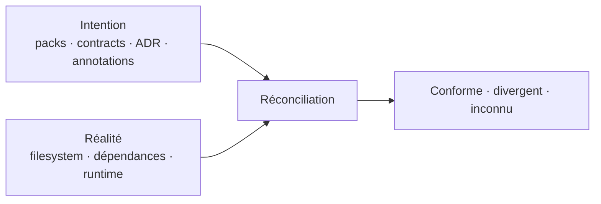

# Principes produit

> **Statut :** règles d'arbitrage de référence<br>
> **Usage :** toute proposition de fonctionnalité doit expliquer comment elle respecte ces principes ou pourquoi une exception est nécessaire

## 1. Un artefact, plusieurs usages

La capture, le diff, les contrats, le scaffolding, les exports et le contexte agent doivent reposer sur le même modèle structurel versionné. Une surface peut projeter ou enrichir ce modèle ; elle ne doit pas créer une seconde vérité incompatible.

**Test d'arbitrage :** cette fonctionnalité étend-elle l'artefact commun ou contourne-t-elle le cœur avec son propre modèle ?

## 2. Déterministe avant d'être intelligent

Les capacités reproductibles restent indépendantes de la locale, de l'ordre d'énumération du filesystem, du terminal et d'un fournisseur d'IA. Les observations non déterministes — taille, timestamps, permissions, résultats heuristiques — vivent dans une couche explicitement distincte.

```text
Structural Artifact                Observation / Analysis
──────────────────                ──────────────────────
name                              size
type                              mtime
hierarchy                         permissions
canonical order                   detected dependencies
relevant options                  heuristic scores
schema version                    model-assisted signals
```

**Test d'arbitrage :** le même input canonique peut-il toujours produire le même output canonique ?

## 3. Local-first, sans sortie secrète

Le cœur fonctionne hors ligne. Aucune donnée de projet ne quitte la machine par défaut. Une intégration réseau future doit être explicite, limitée à une portée visible et désactivable. Un agent ou un service externe ne devient jamais un prérequis pour capturer, comparer ou vérifier la structure.

**Test d'arbitrage :** l'utilisateur sait-il quelles données sortent, vers où et pourquoi avant l'envoi ?

## 4. Lire par défaut, muter par intention

Les opérations se répartissent en deux classes explicites :

| Classe | Capacités | Contrat |
| --- | --- | --- |
| **Read-only** | inspect, diff, query, metrics, check, drift, impact, simulate | N'altère pas le projet observé |
| **Write controlled** | snapshot avec output, scaffold, `conform --apply`, migrate, pack install/update | Plan, validation des chemins, conflits, dry-run lorsque pertinent, rapport et auditabilité |

Une mutation doit refuser de sortir du workspace, s'appliquer transactionnellement autant que possible et exposer ses limites de rollback. Les hooks ne s'exécutent jamais silencieusement : permissions, provenance et commande doivent être visibles, avec une désactivation globale possible.

**Test d'arbitrage :** la puissance supplémentaire est-elle accompagnée d'une preuve, d'une permission et d'une stratégie d'échec proportionnées ?

## 5. Simple au premier contact, profond à la demande

`dirloom` doit rester immédiatement utile sans configuration. La complexité arrive par divulgation progressive : options explicites, presets nommés, sous-commandes spécialisées, TUI, puis Desktop. Le débutant peut réussir sans comprendre le modèle interne ; l'expert peut contrôler les détails sans lutter contre des automatismes cachés.

**Test d'arbitrage :** l'ajout dégrade-t-il la commande minimale ou peut-il vivre derrière une intention explicite ?

## 6. La structure d'abord, le contenu par capacité

Le cœur sait fonctionner sans ouvrir le contenu métier. Les fingerprints de contenu, symboles, imports ou résumés arrivent comme couches optionnelles et déclarées. Cette frontière protège la performance, la confidentialité et l'indépendance aux langages.

**Test d'arbitrage :** cette analyse a-t-elle besoin du contenu ? Si oui, sa portée et son coût sont-ils visibles ?

## 7. Mesurer avant de juger

Les métriques décrivent d'abord des faits : profondeur, fan-out, concentration, croissance, conformité de forme. Les heuristiques portent un nom, une méthode et des limites. Dirloom ne produit pas de « score de qualité » opaque ni de recommandation certaine à partir d'un signal incomplet.

**Test d'arbitrage :** l'utilisateur peut-il distinguer l'observation, l'heuristique et la recommandation ?

## 8. L'intention et la réalité restent distinctes

Un snapshot décrit un état attendu précis. Un contract décrit des états autorisés. Un template décrit une structure matérialisable. Un Architecture Pack réunit templates, contracts et règles d'évolution. Une annotation ajoute de la connaissance. Dirloom peut les réconcilier, mais ne doit jamais les confondre.



**Test d'arbitrage :** le produit dit-il clairement si une information est déclarée, observée ou inférée ?

## 9. La présentation enrichit, elle ne corrompt pas

Couleurs, icônes, badges, liens et vues graphiques sont des projections sémantiques. Ils ne changent ni l'ordre canonique, ni le schéma JSON, ni le fingerprint. Chaque information importante reste compréhensible sans couleur et dispose d'un fallback textuel.

La puissance visuelle recherchée est comparable à celle d'outils terminaux modernes : couleurs `never|always|auto`, icônes `never|unicode|nerd|auto`, thèmes personnalisables, règles par type/nom/extension/état et fallback sans Nerd Font. La référence à eza porte sur cette expressivité, pas sur l'obligation d'en copier les conventions ou les défauts. Les options publiques actuelles d'eza confirment la valeur de thèmes de couleurs et d'icônes configurables, de `NO_COLOR` et de modes d'activation explicites ([manuel eza](https://github.com/eza-community/eza/blob/main/man/eza.1.md)).

**Test d'arbitrage :** la sortie machine reste-t-elle propre, et l'information survit-elle à `--color never --icons never` ?

## 10. Une capacité, des surfaces cohérentes

La CLI est la référence scriptable. Le TUI, Desktop, la CI, les skills et MCP appellent les mêmes services applicatifs et produisent les mêmes concepts. Une fonctionnalité critique ne doit pas exister uniquement dans une interface graphique si elle ne peut être automatisée ou auditée.

**Test d'arbitrage :** le comportement métier est-il réutilisable sans lancer l'interface qui l'a introduit ?

## 11. La compatibilité est un produit

Les schémas, fingerprints, snapshots, templates, Architecture Packs, contracts, plans, Context Receipts et codes de sortie sont versionnés. Une incompatibilité est explicite, migrable et testée. Le format Dirloom peut devenir un actif d'écosystème seulement après avoir prouvé sa stabilité en interne.

**Test d'arbitrage :** comment un artefact créé aujourd'hui sera-t-il lu, refusé ou migré demain ?

## 12. Prouver un workflow avant d'étendre le catalogue

Le premier Architecture Pack `reference-fsd` doit être pris en charge de bout en bout : paramétrage, preview, génération, contracts, Shape Signatures, snapshot, comparaison de forme, conformance, migrations et skills d'agents. Dirloom ne multiplie pas les packs superficiels avant d'avoir rendu ce parcours excellent sur Flutter, Next.js et Hono.js.

**Test d'arbitrage :** cet ajout renforce-t-il le parcours de référence ou dilue-t-il l'effort dans une longue liste de démos incomplètes ?

## 13. Les intégrations transportent la valeur

MCP, skills, IDE et exports sont des canaux. Ils deviennent différenciants seulement par ce qu'ils exposent : structure, diff, conformité, impact, contexte progressif et preuve de fraîcheur. Le nombre d'intégrations n'est pas une mesure de profondeur produit.

**Test d'arbitrage :** l'intégration donne-t-elle accès à une capacité unique de Dirloom ou ajoute-t-elle seulement un nouveau bouton ?

## 14. La qualité fondamentale passe avant l'expansion

Chaque horizon doit préserver les garanties déjà acquises : Windows first-class, performance mesurée, messages actionnables, tests cross-platform, formats stables et documentation utilisable. Une fonctionnalité impressionnante qui fragilise la capture n'est pas prête.

**Test d'arbitrage :** les scénarios du socle restent-ils vrais après l'ajout ?
