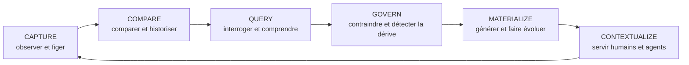
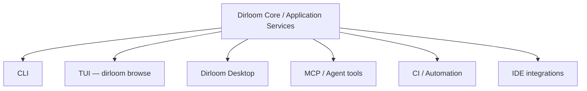
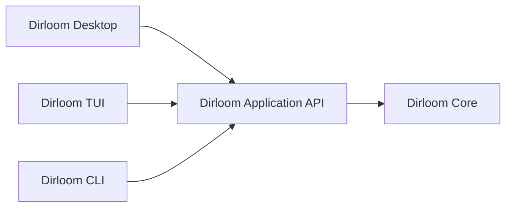
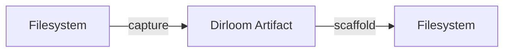
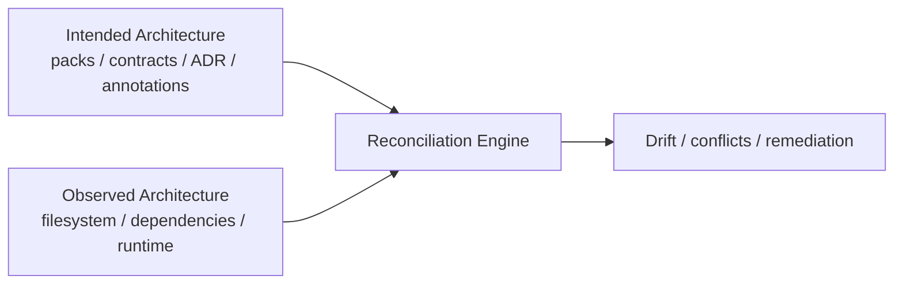
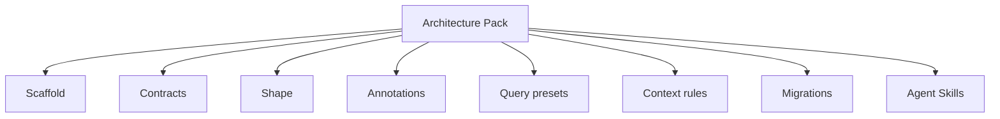
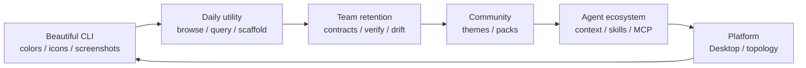
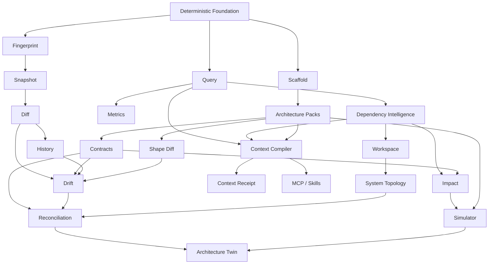

# Dirloom — Roadmap produit stratégique

> **Statut :** Vision produit long terme et roadmap stratégique<br>
> **Date :** 11 août 2026<br>
> **Projet :** Dirloom<br>
> **Socle actuel :** CLI Go multiplateforme — `v0.1.1` publiée<br>
> **Nature du document :** orientation produit ; la spécification v0.1 reste la source normative pour le comportement du MVP<br>
> **Principe directeur :** les numéros de versions proposés ci-dessous sont indicatifs. Les dépendances produit, la qualité et les preuves d’usage priment sur le calendrier.

---

# 1. Résumé exécutif

Dirloom naît d’un besoin simple : obtenir depuis un terminal une représentation propre, déterministe, filtrable et partageable de la structure d’un projet.

Le potentiel du produit va toutefois bien au-delà de la commande `tree`.

La thèse fondatrice est :

> **`tree` affiche une arborescence. Dirloom fait de la structure du projet un artefact exploitable.**

À long terme, Dirloom doit devenir une **couche d’intelligence structurelle pour les projets et systèmes logiciels**.

L’évolution recherchée n’est donc pas :

```text
tree
  ↓
better tree
  ↓
very good tree
```

mais :

```text
Project Structure CLI
        ↓
Structural Artifact Engine
        ↓
Structural Intelligence
        ↓
Architecture Governance
        ↓
Architecture Generation
        ↓
Agent Context Infrastructure
        ↓
Software System Intelligence
```

La structure du système de fichiers constitue le premier niveau d’observation. Elle pourra ensuite être enrichie par les relations de dépendance, les conventions architecturales, l’historique, les annotations, les templates, les informations d’exécution et les topologies interdépôts.

La cohérence du produit doit être conservée à chaque étape :

> **Toute nouvelle fonctionnalité importante doit être une opération logique sur la structure, son artefact, ses relations ou son évolution.**

Dirloom ne doit pas devenir une boîte à outils générique qui accumule des fonctions sans lien entre elles.

---

# 2. North Star — la catégorie produit visée

## 2.1 Positionnement initial

Tagline adaptée à la phase initiale :

> **Clean project trees for humans and AI.**

Elle exprime correctement la valeur de la v0.x : produire une structure propre, portable et immédiatement exploitable.

## 2.2 Positionnement intermédiaire

Lorsque Dirloom saura capturer, comparer, vérifier, générer et interroger les structures :

> **Understand, verify and evolve your project structure.**

## 2.3 Positionnement long terme

Lorsque Dirloom couvrira la structure du code, les dépendances, l’architecture, les agents et la topologie système :

> **Structural intelligence for software systems.**

Cette troisième formulation représente le plafond stratégique du produit.

---

# 3. Les six verbes fondamentaux de Dirloom

La roadmap doit être organisée autour d’opérations cohérentes plutôt qu’autour d’une accumulation de commandes.



## CAPTURE

Transformer une structure observée en artefact canonique et versionnable.

Exemples : rendu texte, JSON, fingerprint, snapshot, annotations, artefacts interdépôts.

## COMPARE

Comprendre comment une structure évolue.

Exemples : diff, détection de déplacements, historique, time machine, shape diff, comparaison de conventions.

## QUERY

Considérer la structure comme une base de connaissances locale.

Exemples : requêtes, métriques, recherche structurelle, impact, dépendances, topologie.

## GOVERN

Empêcher l’architecture de dériver silencieusement.

Exemples : contracts, verify, policy checks, drift, conformity, reconciliation.

## MATERIALIZE

Faire de l’architecture une chose exécutable.

Exemples : scaffold, templates, Architecture Packs, migrations, conformance plans.

## CONTEXTUALIZE

Fournir exactement la bonne représentation aux humains, outils et agents.

Exemples : TUI, Desktop, contexte sous budget, context compiler, context receipts, MCP, skills pour agents.

---

# 4. Principes non négociables à long terme

## 4.1 Moteur sans interface imposée (`headless`)

Le moteur Dirloom doit rester indépendant de ses interfaces.



Aucune interface ne doit réimplémenter le scanner, le moteur de filtres, le modèle, le diff, les contracts ou les règles de contexte.

## 4.2 Priorité au fonctionnement local (`local-first`)

Les fonctions fondamentales doivent fonctionner localement.

Le réseau peut devenir nécessaire pour installer un Architecture Pack, synchroniser un registre, vérifier une signature, télécharger un thème ou interroger un dépôt distant explicitement demandé. Il ne doit jamais devenir obligatoire pour utiliser le moteur principal.

## 4.3 Déterminisme avant magie

Une fonctionnalité automatique ne doit pas introduire de comportement opaque dans l’artefact canonique.

Les heuristiques doivent être documentées, explicables, versionnées lorsqu’elles influencent un résultat machine, et désactivables lorsque pertinent.

## 4.4 Pensé pour les humains et les machines

Chaque capacité majeure doit idéalement proposer une expérience utilisateur lisible, une sortie machine versionnée, des codes de sortie fiables et une intégration CI.

## 4.5 La sécurité évolue avec les mutations

La v0.1 fonctionne essentiellement en lecture seule.

Avec `scaffold`, `migrate`, `conform` ou d’autres opérations génératives, le contrat évoluera.

Les commandes mutantes devront progressivement imposer un `dry-run`, un plan explicite, une validation préalable et la détection des conflits. Elles devront aussi assurer une écriture transactionnelle lorsque possible, un rollback lorsque nécessaire et une confirmation pour les opérations dangereuses. Enfin, elles devront refuser toute écriture hors du périmètre autorisé, désactiver par défaut les hooks arbitraires et garantir la provenance des packs.

## 4.6 Pas de LLM obligatoire dans le moteur central

Les capacités structurelles — contrats, diff, requêtes, scaffold et contexte déterministe — ne doivent pas dépendre d’un modèle.

Un LLM pourra être utilisé plus tard comme couche optionnelle d’assistance, jamais comme source de vérité structurelle.

---

# 5. Niveaux de valeur produit

| Niveau | Signification |
|---|---|
| **Foundation** | Nécessaire pour rendre les capacités futures possibles |
| **Killer feature** | Peut devenir une raison majeure d’installer ou de conserver Dirloom |
| **Game-changer** | Peut changer la catégorie perçue du produit ou créer un workflow difficile à remplacer |
| **Moonshot** | Ambition long terme, techniquement plus risquée, mais susceptible de repositionner profondément le produit |

---

# 6. Pilier I — Structural Artifact & Presentation

## 6.1 Fondation v0.1 — arbre déterministe

**Niveau : Foundation**

La v0.1 reste la première preuve du modèle Dirloom :

```bash
dirloom
```

```text
project/
├── src/
├── tests/
├── README.md
└── package.json
```

Capacités livrées :

- analyse multiplateforme ;
- profondeur ;
- filtres ;
- `.gitignore` ;
- fichiers cachés ;
- tri déterministe ;
- Unicode ;
- ASCII ;
- Markdown ;
- JSON schema v1 ;
- symlinks/junctions ;
- stdout propre ;
- export transactionnel ;
- tests Windows/Linux/macOS ;
- Cobra ;
- GoReleaser.

La v0.1 constitue le **contrat de confiance** sans lequel les fonctions de diff, snapshot, verify ou contexte seraient fragiles.

## 6.2 Configuration projet et utilisateur

**Niveau : Foundation / Adoption**

**Statut : socle implémenté dans l'incrément initial de v0.2.** Les presets intégrés puis la présentation thématique ont été livrés dans les incréments suivants, avec des moteurs distincts et une résolution commune inspectable.

Ordre livré :

```text
CLI explicite > configuration projet > configuration utilisateur > défauts intégrés
```

Exemple :

```yaml
# .dirloom.yaml
schemaVersion: 1

defaults:
  depth: 6
  dirsOnly: false
  hidden: false
  format: text
  style: unicode

filters:
  useDefaultIgnores: true
  useGitignore: true

ignore:
  - generated/**
  - vendor/cache/**
```

Le schéma v1, la découverte bornée par Git, les contrôles `--config`, `--no-user-config`, `--no-config`, `--depth unlimited` et `dirloom config explain` sont couverts par des contrats publics et des tests multiplateformes. Les listes `ignore` sont additives dans l'ordre utilisateur, projet puis CLI ; les scalaires suivent la priorité générale.

Usages : exclusions partagées, préférences personnelles, monorepos, CI reproductible. Le schéma v1 accepte `presentation.color`, `presentation.icons` et `presentation.theme`, avec les défauts `auto`, `never` et `default`, ajoutés avant la première publication de v0.2. Les presets ne définissent aucune de ces valeurs.

## 6.3 Presets

**Niveau : Adoption**

**Statut : socle livré dans v0.2.** Les quatre définitions sont compilées, déterministes, activables par CLI ou configuration, neutralisables et inspectables en texte ou JSON.

```bash
dirloom --preset docs
dirloom --preset compact
dirloom --preset monorepo
dirloom --preset ai
```

Un preset doit être inspectable :

```bash
dirloom preset explain ai
```

La priorité reste explicite : sélection CLI, puis projet, puis utilisateur. Les valeurs explicites de la couche active remplacent les effets du preset, et `dirloom config explain` conserve leur provenance.

Le preset `ai` livré compose uniquement les capacités existantes. Statistiques, compression sous budget et appels LLM restent hors de ce socle et appartiennent aux évolutions avancées du pilier Agent Context Infrastructure.

Les presets réduisent le coût d’entrée sans retirer la puissance de la CLI.

## 6.4 Visual Theme Engine — catalogue sémantique, couleurs et icônes

**Niveau : Adoption / UX amplifier**

**Statut : socle livré dans v0.2.** Le moteur comprend le catalogue sémantique v1, le schéma public de thème v1, quatre thèmes intégrés, les thèmes YAML confinés, les diagnostics et la projection terminal sûre. Les états de diff, conformité, sévérité et annotation restent réservés aux capacités qui les produiront.

Showcase :

```bash
dirloom --theme vivid --icons nerd
```

Le catalogue décrit le projet sur deux axes : un kind technique pour le glyphe et des rôles structurels ordonnés pour la couleur et les styles. Le contrat v1 contient exactement 256 matchers, 96 kinds hiérarchiques et 16 rôles. `_test.go` conserve ainsi une icône Go avec le rôle `test`, tandis que `.pb.go` conserve Go avec `generated`.

Les quatre thèmes `default`, `midnight`, `daylight` et `vivid` consomment ce catalogue unique. `vivid` l'interprète avec une identité two-tone indépendante : texte par rôle, couleur de glyphe par kind. La classification intégrée suit symlink, dossier exact, nom exact, suffixe composé le plus long, extension puis fallback. Elle ne lit ni contenu, shebang, MIME, état Git ou métadonnée étendue.

### Canonical Mode vs Presentation Mode

La présentation ne modifie jamais l'artefact canonique.

```text
Canonical Artifact
    ├── stable bytes and order
    ├── no ANSI or presentation glyph
    ├── no terminal detection
    └── machine-safe

Presentation Layer
    ├── semantic Kind + roles
    ├── colors and text styles
    ├── Unicode or Nerd glyphs
    ├── terminal capabilities
    └── built-in or confined custom theme
```

Défauts livrés :

```text
color: auto
icons: never
theme: default
```

Modes publics :

```text
--color never|always|auto
--icons never|unicode|nerd|auto
--theme default|midnight|daylight|vivid|<path>
```

`--icons auto` active Unicode seulement sur un TTY éligible ; Nerd reste explicite. Le thème seul n'active aucune icône. Pipes, redirections, `--output`, CI et `TERM=dumb` restent neutres en mode automatique. `NO_COLOR` désactive l'ANSI sauf surclassement CLI explicite par `--color always`. Markdown, Markdown sémantique, JSON, diagnostics, aides et erreurs restent canoniques.

Commandes livrées :

```bash
dirloom theme list
dirloom theme explain vivid
dirloom theme validate .dirloom/themes/team.yaml
dirloom theme classify src/main.go --theme vivid --as json
```

`theme classify` charge le thème avant la cible, confine l'entrée à `--root`, utilise `Lstat`, ne suit pas le symlink final, ne lit aucun contenu et ne scanne aucun descendant.

Le schéma public de thème v1 remplace le prototype pré-release sans compatibilité. Il exige les deux versions indépendantes :

```yaml
schemaVersion: 1
catalogVersion: 1
name: team
appearance: dark

palette:
  source: "#66F0C0"
  generated: "#A1AAC0"

kinds:
  source:
    iconColor: source

roles:
  source:
    color: source
  generated:
    color: generated
    styles: [dim]

rules:
  - match: { path: "tools/codegen.go" }
    kind: source.go
    role: generated
    iconColor: null
    styles: []
```

Le schéma distingue propriété absente, valeur explicite et `null`; applique les bindings token, parents de kind, kind spécifique, rôle puis overrides directs ; et sépare les spans ANSI d'icône et de texte. Un binding de kind/rôle futur produit un warning stable ; une action `kind:` ou `role:` inconnue dans une règle échoue.

Dirloom pourra dépasser ce socle en colorant des concepts architecturaux lorsque le moteur les produira : nœuds ajoutés, supprimés ou déplacés ; violations et dérives ; modules obsolètes ; responsabilités ; éléments gérés par template ; impacts directs ou transitifs. Ils ne sont pas présentés comme disponibles en v0.2.

## 6.5 Exports visuels

**Niveau : Ecosystem amplifier**

**Statut : socle livré dans v0.2.** Les formats `mermaid`, `graphviz` (alias `dot`) et `d2` projettent la vue `structure` depuis `diagram.Document`. Dirloom n'émet que des sources DSL ; le rendu SVG/PNG reste externe. `maxNodes` est illimité par défaut, avec warning à 500 nœuds.

```bash
dirloom --format mermaid
dirloom --format graphviz
dirloom --format d2
```

Usages : README, documentation d’architecture, rapports, présentations. Contrat, échappement et budget : [exports graphiques](../graph-exports.md).

Le socle `markdown-tree` est livré séparément : il couvre la documentation Markdown sémantique sans devenir un export graphique, sans HTML et sans réutiliser la présentation terminal.

## 6.6 Clipboard, completions et distribution

**Niveau : Adoption**

```bash
dirloom --copy
dirloom --format markdown --copy
```

Complétions PowerShell/bash/zsh/fish et distribution via GitHub Releases, winget, Scoop, Homebrew, puis d’autres gestionnaires de paquets soutenables.

---

# 7. Pilier II — Interfaces interactives

## 7.1 `dirloom browse` — TUI structure-first

**Niveau : Killer UX**

```bash
dirloom browse
```

Le TUI n’est pas un gestionnaire de fichiers : il explore **l’artefact Dirloom**.

Capacités :

- navigation ;
- expand/collapse ;
- recherche ;
- profondeur interactive ;
- filtres ;
- sélection/exclusion temporaire ;
- aperçu texte/Markdown/JSON ;
- thèmes, couleurs et icônes ;
- copy/export ;
- annotations ;
- métriques ;
- diff ;
- violations ;
- context selection.

Vue cible :

```text
┌ Dirloom ────────────────────────────────────────────────────────────┐
│ Project: sonora                     Theme: midnight   Depth: ∞      │
├──────────────────────────────┬──────────────────────────────────────┤
│ STRUCTURE                    │ INSPECT                              │
│ ▼ src/                       │ Path       src/features/payments      │
│   ▼ features/                │ Type       module                     │
│     ▶ auth/                  │ Files      23                         │
│     ▼ payments/              │ Owner      commerce                   │
│       ▶ domain/              │ Contract   ✓ compliant                │
│       ▶ application/         │ Drift      MEDIUM                     │
│       ▶ infrastructure/      │                                      │
├──────────────────────────────┴──────────────────────────────────────┤
│ / search  Space select  f filters  d diff  i impact  c context     │
└─────────────────────────────────────────────────────────────────────┘
```

Garde-fou : pas d’éditeur, pas de suppression générique, pas de file manager complet.

## 7.2 Dirloom Desktop

**Niveau : Game-changer de surface / Adoption massive potentielle**

Dirloom Desktop sera une application graphique distincte partageant le même moteur central.

Écrans envisagés :

```text
Workspace
├── Explorer
├── Structural Diff
├── History / Time Machine
├── Architecture Contracts
├── Drift Dashboard
├── Shape Comparison
├── Scaffold Studio
├── Architecture Packs
├── Impact Lens
├── Context Composer
└── System Topology
```

Parcours type : ouvrir un dépôt → sélectionner une fonctionnalité → voir son contrat et sa dérive → lancer un plan de conformité → prévisualiser les mutations → exporter ou appliquer.

Architecture :



Le choix technologique Desktop doit être confirmé au moment du milestone ; une solution Go-native avec frontend web est naturellement cohérente.

---

# 8. Pilier III — Structural Version Control

## 8.1 Structural Fingerprint

**Niveau : Foundation stratégique**

```bash
dirloom fingerprint
```

```text
dlm:v1:sha256:8e5b2d7f...
```

Usages : changement structurel, cache, snapshot, contexte IA périmé, CI, historique.

Évolution possible :

```text
structureFingerprint
dependencyFingerprint
architectureFingerprint
contextFingerprint
```

## 8.2 `snapshot`

**Niveau : Killer feature**

```bash
dirloom snapshot --output architecture.dlm.json
```

Usages : état de référence, migration, audit, release, documentation, comparaison de branches.

## 8.3 `verify`

**Niveau : Killer feature CI**

```bash
dirloom verify architecture.dlm.json
```

`verify` répond : **« est-ce toujours cette structure ? »**

`check` répondra : **« cette structure respecte-t-elle les règles ? »**

## 8.4 Structural Diff

**Niveau : Killer feature majeure**

```bash
dirloom diff snapshot-a snapshot-b
dirloom diff main feature/payments
dirloom diff HEAD~10 HEAD
```

```text
Structural Diff

ADDED
  + src/features/checkout/

REMOVED
  - src/legacy/payment/

MOVED
  ~ src/shared/auth/
    → src/features/auth/

CHANGED
  src/features/payments/
  files: 18 → 27
```

Usages : revue d’architecture, migration, refactoring, revue de PR, monorepo.

## 8.5 Détection de déplacements

Stratégie progressive :

```text
Tier 1 — path/name/subtree shape
Tier 2 — metadata optionnelle
Tier 3 — content fingerprinting optionnel
Tier 4 — semantic identity
```

Le contenu ne doit pas devenir obligatoire pour le moteur structurel canonique.

## 8.6 Structural History / Time Machine

**Niveau : Killer feature / partage**

```bash
dirloom history
```

```text
Jan 2026  42 modules
   │
Mar 2026  + features/
   │
May 2026  shared/ +170%
   │
Jun 2026  billing extracted
   │
Aug 2026  6 domain modules
```

Questions : quand un module est apparu, où la croissance se concentre, quand la profondeur a explosé, quand la dérive a commencé.

## 8.7 `watch` et Structural Event Stream

**Niveau : Infrastructure**

```bash
dirloom watch --format ndjson
```

```json
{"event":"node.added","path":"src/features/payments"}
{"event":"node.moved","from":"src/shared/auth","to":"src/features/auth"}
```

Usages : TUI, Desktop, IDE, fingerprint incrémental, MCP et contrôles architecturaux en continu.


---

# 9. Pilier IV — Architecture Generation : Scaffold, Templates & Packs

Ce pilier constitue une évolution volontaire du contrat de sécurité : Dirloom ne se contente plus d’observer une structure, il peut la matérialiser.

## 9.1 `scaffold` — opération inverse de l’artefact

**Niveau : Killer feature**

```bash
dirloom scaffold --from feature.dlm.json ./src/features/payments
```



Usages : créer un module, reproduire une architecture, initialiser un projet, matérialiser un snapshot, enseigner une convention, accélérer l’intégration des nouveaux contributeurs.

## 9.2 Scaffold Studio — vraie plateforme de génération

**Niveau : Game-changer**

Dirloom ne doit pas rester limité à « créer des dossiers vides ». À terme, il peut réellement concurrencer les générateurs de projets traditionnels sur le terrain où sa structure déterministe lui donne un avantage.

Fonctions envisagées :

- variables typées ;
- prompts ;
- defaults ;
- validation ;
- chemins paramétrés ;
- fichiers de contenu ;
- stubs ;
- conditionnels ;
- répétitions contrôlées ;
- variantes de framework ;
- fichiers facultatifs ;
- conventions de nommage ;
- valeurs calculées simples ;
- composition de templates.

Exemple :

```bash
dirloom scaffold feature payments \
  --pack reference-fsd \
  --variant flutter
```

```text
Plan

CREATE  lib/features/payments/...
CREATE  lib/features/payments/.../payments_repository.dart
CREATE  lib/features/payments/.../payments_service.dart
CREATE  test/features/payments/...

Contract validation
  ✓ structure compliant

Conflicts
  none

Apply? [y/N]
```

## 9.3 Dry-run, Plan & Apply

**Niveau : Foundation sécurité**

Toute génération sérieuse doit être précédée d’un plan.

```bash
dirloom scaffold feature payments --dry-run
```

ou :

```bash
dirloom scaffold plan ...
dirloom scaffold apply <plan>
```

Le plan précise créations, modifications, conflits, écrasements, contracts, chemins, hooks éventuels et provenance du pack.

> Une opération mutante doit être aussi explicable que possible avant son application.

## 9.4 Premier Architecture Pack : architecture FSD-like de référence

**Niveau : Killer adoption seed**

Le premier pack officiel doit être un cas réel utilisé quotidiennement, pas un template de démonstration artificiel.

La première famille de référence sera l’architecture FSD-like personnalisée utilisée sur :

- Flutter ;
- Next.js ;
- Hono.js.

Le nom du style architectural sera défini ultérieurement.

Organisation conceptuelle :

```text
Reference FSD-like Architecture
├── flutter variant
├── nextjs variant
└── hono variant
```

Les variantes partagent les mêmes principes mais adaptent conventions, dossiers, types de fichiers, patterns de framework, tests et entrypoints.

### Pourquoi c’est stratégique

Ce pack sert simultanément au dogfooding et au test de la puissance réelle de `scaffold`. Il fournit le premier exemple officiel et démontre les Architecture Contracts et Shape Diff. Il sert de base aux skills pour agents et prouve qu’un style architectural peut devenir exécutable.

## 9.5 Architecture Packs

**Niveau : Game-changer / potentiel d’écosystème**

Un Architecture Pack ne doit pas être seulement un template.

```text
Architecture Pack
├── templates
├── variants
├── structural contracts
├── naming rules
├── annotations defaults
├── shape signatures
├── query presets
├── context rules
├── visual metadata
├── migrations
└── agent skills
```

Exemple :

```bash
dirloom pack add reference-fsd
dirloom scaffold feature payments --variant flutter
dirloom check
dirloom context "add payments retry"
```

Toutes ces commandes utilisent le même pack.

### Potentiel game-changer

Le pack transforme une convention d’architecture en **artefact installable, vérifiable, génératif et exploitable par les agents**.

## 9.6 Capture Template — dériver un template depuis un projet réel

**Niveau : Game-changer potentiel**

```bash
dirloom template capture ./src/features/auth
```

Une structure réelle :

```text
auth/
├── auth.service.ts
├── auth.types.ts
└── index.ts
```

peut devenir :

```text
{{feature}}/
├── {{feature}}.service.ts
├── {{feature}}.types.ts
└── index.ts
```

L’utilisateur confirme ou corrige les variables détectées.

Valeur : réduire drastiquement le coût de création d’un template à partir de conventions existantes.

## 9.7 Architecture Pack migrations

**Niveau : Game-changer**

Les générateurs traditionnels sont souvent utilisés une seule fois. Dirloom doit viser un modèle vivant.

```bash
dirloom pack upgrade reference-fsd
```

ou :

```bash
dirloom migrate --from reference-fsd@1 --to reference-fsd@2
```

Exemple : le pack v2 exige désormais une nouvelle organisation. Dirloom détecte l’ancien shape, mesure l’écart et génère un plan de migration.

### Pourquoi c’est puissant

Le scaffolding cesse d’être une opération ponctuelle. L’architecture devient **maintenable dans le temps**.

## 9.8 Registre de packs et de templates

**Niveau : Ecosystem amplifier**

```bash
dirloom pack search flutter
dirloom pack install org/reference-fsd
dirloom pack update
```

Catégories : official, verified, community, private.

Exigences :

- versionnement ;
- checksums ;
- signatures lorsque pertinent ;
- provenance ;
- permissions déclarées ;
- hooks signalés ;
- compatibilité Dirloom.

Un registre bien conçu peut devenir un puissant moteur d’adoption communautaire.

---

# 10. Pilier V — Structural Intelligence

## 10.1 `query` — interroger la structure

**Niveau : Killer feature transversale**

```bash
dirloom query 'dirs where depth > 6'
dirloom query 'files where extension == ".dart"'
dirloom query 'dirs where children == 0'
```

Sorties :

```bash
dirloom query '...' --format table
dirloom query '...' --format json
```

La syntaxe doit rester suffisamment familière ; il faut éviter un DSL étendu avant d’avoir des usages réels.

### Pourquoi c’est une killer-feature

`query` transforme Dirloom en primitive réutilisable depuis CLI, scripts, CI, TUI, Desktop, MCP et agents.

## 10.2 Structural Artifact vs Observation Metadata

**Niveau : Foundation conceptuelle**

Ne pas polluer l’artefact canonique avec des données intrinsèquement variables.

```text
Structural Artifact
├── path/name
├── type
├── hierarchy
└── deterministic attributes

Observation Layer
├── size
├── mtime
├── permissions
├── owner
└── filesystem-specific metadata
```

Ainsi :

```bash
dirloom query 'dirs where depth > 6'
```

reste déterministe.

Alors que :

```bash
dirloom query --observe 'files where size > 100kb'
```

travaille explicitement sur l’état local.

## 10.3 Structural Metrics

**Niveau : Intelligence / Adoption**

```bash
dirloom metrics
```

```text
Structure Metrics

Directories              184
Files                    971
Maximum depth             11
Median depth               5

Highest fan-out
  src/shared/              48
  src/components/          37

Structural concentration
  top 5 directories contain 63% of files
```

Métriques envisageables :

- profondeur ;
- fan-out ;
- concentration ;
- nombre de modules ;
- distribution des fichiers ;
- symétrie ;
- croissance ;
- densité ;
- ratio tests/code ;
- ratio generated/source lorsque identifiable.

Garde-fou : pas de « score d’architecture » opaque. Les heuristiques doivent être explicables.

## 10.4 Structural Shape Diff

**Niveau : Killer feature équipe**

Comparer des modules par **forme**, pas par contenu.

```bash
dirloom shape compare services/*
```

```text
Structural Conformity

billing     100%
orders       96%
users        41%

users differs from dominant shape:

MISSING
  domain/
  application/
  infrastructure/

ADDITIONAL
  controllers/
  services/
  repositories/
```

Usages : microservices, fonctionnalités FSD-like, plugins, paquets, modules, monorepos et conventions de tests.

### Différenciation

Détecter une divergence architecturale avant même d’analyser les imports ou le code.

## 10.5 Shape Signatures

**Niveau : Foundation pour packs/contracts**

```text
feature-shape:v3
├── domain/
├── application/
├── infrastructure/
├── presentation/
└── tests/
```

Une signature peut être utilisée par `shape compare`, contracts, scaffold, conform, drift et packs.

## 10.6 Dependency Intelligence — adaptateurs multilangages

**Niveau : Game-changer technique**

Dirloom doit pouvoir enrichir l’arbre du système de fichiers avec la structure des dépendances.

Priorités naturelles :

- Dart/Flutter ;
- TypeScript/JavaScript ;
- Go ;
- puis Python, Rust et autres selon adoption.

Architecture :

```text
Dirloom Core
    ↓
Analyzer Interface
    ├── Dart analyzer
    ├── TypeScript analyzer
    ├── Go analyzer
    └── parser adapters lorsque pertinent
```

L’objectif n’est pas de construire un compilateur universel, mais de fournir une interface stable à des analyseurs spécialisés.

## 10.7 Impact Lens

**Niveau : Killer feature architecture**

```bash
dirloom impact src/features/payments
```

```text
PAYMENTS — Impact

Direct dependents
  checkout
  orders

Transitive dependents
  web-api
  worker

Tests potentially impacted
  32

Configuration
  PAYMENT_*
  RETRY_*

Runtime
  api
  payments-worker
```

Usages : refactoring, suppression, déplacement, extraction de service, migration et revue de PR.

### Impact produit

Dirloom commence à répondre à : **« Qu’est-ce qui risque de casser si je change ceci ? »**

## 10.8 Architecture Simulator

**Niveau : Game-changer majeur**

```bash
dirloom simulate move \
  src/shared/payment \
  src/features/payment
```

```text
Simulation

MOVE
  src/shared/payment
  → src/features/payment

Expected impact

  14 imports affected
  32 tests potentially impacted
   3 architecture violations fixed
   1 new violation introduced

Shape conformity
  before   71%
  after    89%

Assessment
  favorable
```

La simulation ne modifie pas le système de fichiers : elle produit un plan.

Évolutions possibles :

```bash
dirloom simulate rename ...
dirloom simulate scaffold ...
dirloom simulate extract-module ...
dirloom simulate conform ...
```

C’est l’une des fonctionnalités les plus susceptibles de faire passer Dirloom du statut d’outil d’observation à celui **d’outil de décision architecturale**.

---

# 11. Pilier VI — Architecture Governance

## 11.1 Architecture Contracts

**Niveau : Killer feature CI / équipe**

```bash
dirloom check
```

Exemple :

```yaml
contracts:
  - name: feature-shape
    match: src/features/*
    require:
      - domain/
      - application/
      - presentation/
      - tests/

  - name: max-feature-depth
    match: src/features/**
    maxDepth: 8
```

Évolution avec dépendances :

```yaml
dependencies:
  forbid:
    - from: src/features/*
      to: src/features/*/internal/**
```

Dirloom passe de « voici l’architecture » à **« voici les règles de l’architecture, et elles sont vérifiées automatiquement »**.

## 11.2 Niveaux de sévérité des contrats et CI

Niveaux :

```text
info
warning
error
```

```text
Architecture Check

ERROR   payments missing domain/
WARN    shared/ fan-out exceeds configured limit
INFO    legacy/ marked for deprecation

Result: FAILED
```

Intégrations à GitHub Actions, GitLab CI et d’autres systèmes de CI ; hooks pre-commit/pre-push optionnels.

## 11.3 `explain`

**Niveau : Adoption**

```bash
dirloom check --explain
dirloom explain violation DLM0042
```

Dirloom doit expliquer la règle, le chemin, la cause, la source du contrat et, lorsque pertinent, une résolution possible.

## 11.4 Architecture Drift

**Niveau : Killer feature majeure**

```bash
dirloom drift
```

```text
Architecture Drift

HIGH
  shared/ grew 34 → 117 files in 4 months

HIGH
  payments now depends on 5 sibling features

MEDIUM
  feature shape conformity fell 92% → 73%

MEDIUM
  maximum nesting increased 6 → 10
```

`check` détecte les violations actuelles ; `drift` détecte **la direction prise par l’architecture**.

Usages : revue par le CTO ou l’architecte, suivi de la dette, monorepos, CI et revues régulières.

## 11.5 Persistent Structural Annotations

**Niveau : Killer knowledge layer**

```yaml
annotations:
  src/features/payments:
    description: Payment domain
    owner: commerce
    status: active
    adr:
      - docs/adr/ADR-004.md

  scripts/legacy:
    status: deprecated
    removeAfter: 2027-01
```

Champs possibles : description, owner, status, lifecycle, ADR, ticket, criticality, tags, confidentialité, deprecation, runtime responsibility.

Exploitation : TUI, Desktop, context compiler, impact, query, MCP, rapports.

## 11.6 Conformance

**Niveau : Game-changer, fusion governance + scaffold**

```bash
dirloom conform src/features/payments \
  --against pack:reference-fsd/flutter
```

```text
Conformance Plan

MISSING
  application/
  tests/

MISPLACED
  payment_repository.dart
    expected: infrastructure/

NON-COMPLIANT
  naming: PaymentRepo.dart

No changes applied.
```

Puis :

```bash
dirloom conform --apply <plan>
```

Dirloom ne se contente plus de détecter une divergence : il sait proposer un chemin reproductible vers l’architecture cible.

## 11.7 Architecture Reconciliation

**Niveau : Moonshot**



Exemple :

```text
Intent
  Payments must not depend on Orders.

Observed
  Payments → Orders
  7 direct imports
  2 transitive paths

Status
  DRIFTING
```

Ce moteur peut devenir le cœur d’un véritable **digital twin architectural**.

---

# 12. Pilier VII — Agent Context Infrastructure

## 12.1 Preset IA déterministe

**Niveau : Adoption**

**Statut : socle livré dans v0.2 ; enrichissements analytiques futurs.**

```bash
dirloom --preset ai
```

Le socle livré réduit le bruit avec une profondeur bornée, un rendu Markdown et des exclusions adaptées, tout en conservant les fichiers sources. Il ne calcule ni statistiques de taille, ni budget de contexte et n'effectue aucun appel LLM. Les statistiques déterministes constituent un enrichissement futur avant la compression sous budget de la section suivante.

## 12.2 Structural Compression sous budget

**Niveau : Killer feature AI**

```bash
dirloom context --budget 2000
```

```text
src/
├── core/
│   └── […]
├── features/
│   ├── payments/
│   │   ├── domain/
│   │   ├── application/
│   │   └── […]
│   └── [17 other features]
└── tests/
    └── [142 files]
```

Heuristiques possibles : replier sous-arbres répétitifs, conserver zones à forte information, agréger fixtures/assets, préserver entrypoints, respecter annotations, prioriser modules structurants.

Algorithme déterministe, versionné et explicable.

## 12.3 Task-aware Context Compiler

**Niveau : Game-changer AI**

```bash
dirloom context \
  "Fix retry handling for failed payments" \
  --budget 12000
```

```text
Selected context

src/features/payments/      direct task domain
src/infrastructure/queues/  retry dependency
src/shared/events/          imported by payments
tests/payments/             behavioral coverage

Excluded
  93.2% repository

Estimated budget
  11,740 tokens
```

Le contexte doit être sélectionné par intelligence structurelle : hiérarchie, contrats, dépendances, responsabilités, impact, annotations, historique et termes de la tâche.

## 12.4 Context Receipt / Lockfile

**Niveau : Game-changer très différenciant**

```bash
dirloom context "..." --lock
```

```json
{
  "schemaVersion": 1,
  "artifactFingerprint": "dlm:...",
  "contextFingerprint": "dlmctx:...",
  "selectionAlgorithm": "dirloom-context-v1",
  "budget": 12000,
  "included": [],
  "excluded": [],
  "reasons": {}
}
```

Question résolue : **« Qu’est-ce que l’agent avait exactement sous les yeux lorsqu’il a pris sa décision ? »**

Usages : audit, reproduction, débogage, revue, conformité et évaluation comparative des agents.

## 12.5 Context Staleness Verification

**Niveau : Killer workflow**

```bash
dirloom context verify context.lock.json
```

```text
Context is stale

3 selected files changed
1 dependency added
architecture fingerprint differs

Recompile context before continuing.
```

## 12.6 Progressive Context Disclosure

**Niveau : Game-changer agent**

```text
Agent
  ↓
project skeleton
  ↓
expand payments
  ↓
show dependencies
  ↓
show relevant symbols
  ↓
retrieve selected content
```

Avantages : moins de tokens, moins de bruit, moindre exposition de données, meilleure explicabilité et navigation proche de celle d’un humain.

## 12.7 Serveur MCP

**Niveau : Integration / Ecosystem amplifier**

Le MCP n’est pas, en soi, la fonctionnalité phare. Ce qui compte est l’intelligence exposée.

Outils possibles :

```text
get_structure
query_structure
get_snapshot
get_diff
get_drift
check_contracts
get_impact
simulate_change
compile_context
verify_context
expand_node
get_annotations
```

Le MCP est un **transport de Dirloom Intelligence**, pas un second moteur central.

## 12.8 Skills pour agents de code

**Niveau : Killer adoption dans les workflows agents**

Pack initial :

```text
dirloom-inspect
dirloom-check
dirloom-scaffold
dirloom-diff
dirloom-impact
dirloom-context
dirloom-conform
```

Exemple de workflow `dirloom-scaffold` :

```text
1. inspect project Dirloom config
2. resolve Architecture Pack
3. scaffold --dry-run
4. inspect plan
5. apply
6. run dirloom check
7. report result
```

Règle forte :

> Avant de créer manuellement une nouvelle fonctionnalité dans un dépôt possédant un Architecture Pack Dirloom, un agent doit vérifier si un `scaffold` officiel existe et le privilégier.

## 12.9 Context Firewall

**Niveau : Game-changer sécurité**

Lorsque Dirloom commencera à lire du contenu pour les agents, il devra classifier les sources :

```text
trusted source
generated source
external dependency
remote content
probable secret
suspicious instruction
executable config
```

Usages : limiter l’exposition des secrets, des contenus non fiables et des instructions injectées.

Principe :

> Donner à l’agent le contexte nécessaire sans supposer que tout le dépôt mérite le même niveau de confiance.


---

# 13. Pilier VIII — Interdépôts et topologie système

## 13.1 Espace de travail interdépôts

**Niveau : Game-changer équipe / plateforme**

```yaml
# dirloom.workspace.yaml
repositories:
  - path: ./web
  - path: ./api
  - path: ./worker
  - path: ./mobile
  - path: ./infrastructure
```

```bash
dirloom workspace
```

Première étape : une représentation structurelle commune. Étapes suivantes : les relations entre dépôts.

## 13.2 Dépendances interdépôts

```text
web      → api
mobile   → api
api      → shared-contracts
worker   → shared-contracts
infra    → api deployment
```

Usages : plateformes, microservices, SDK, organisation unique couvrant plusieurs dépôts et architecture d’entreprise.

## 13.3 Code → Runtime → Infrastructure Topology

**Niveau : Moonshot**

Élargir progressivement la notion de structure :

```text
Filesystem structure
        ↓
Code structure
        ↓
Dependency structure
        ↓
Package/service structure
        ↓
Container structure
        ↓
Infrastructure structure
        ↓
Runtime topology
```

Commande future :

```bash
dirloom topology
```

```text
Platform
├── web
│   └── HTTP → api
├── mobile
│   └── HTTP → api
├── api
│   ├── SQL → postgres
│   ├── PUB → redis
│   └── S3 → object-storage
└── worker
    └── SUB → redis
```

## 13.4 Architecture Twin

**Niveau : Moonshot ultime**

Dirloom maintient deux représentations :

```text
INTENDED
  packs
  contracts
  annotations
  ADR
  declared topology

OBSERVED
  filesystem
  dependencies
  containers
  configuration
  runtime evidence
```

Le moteur compare :

```text
intended vs observed
```

et produit drift, violations, divergences, impact, simulation et plans de conformance.

---

# 14. Écosystème et extensibilité

## 14.1 SDK d’analyseurs

**Niveau : Platform**

Créer une interface permettant d’ajouter des analyseurs sans modifier le moteur central.

Exemples :

- Dart ;
- TypeScript ;
- Go ;
- Python ;
- Rust ;
- Docker ;
- Kubernetes ;
- Terraform.

Les analyseurs doivent produire des contrats internes versionnés.

## 14.2 Pack SDK

Permettre aux équipes de créer :

- templates ;
- contracts ;
- queries ;
- annotations ;
- migrations ;
- context policies ;
- agent skills.

## 14.3 Registre de thèmes

```bash
dirloom theme search nord
dirloom theme install catppuccin
```

Les thèmes restent purement présentationnels.

## 14.4 Intégrations aux IDE

Extensions possibles : VS Code, JetBrains et autres IDE via protocoles ouverts.

Fonctions : explorer structure, contract diagnostics, drift, scaffold, impact, context selection.

## 14.5 Intégrations CI

Offrir des intégrations natives/documentées pour :

```text
dirloom verify
dirloom check
dirloom drift
dirloom shape compare
```

Sorties machine : JSON, annotations CI, SARIF lorsque pertinent.

---

# 15. Structural Artifact Format

**Niveau : Foundation d’écosystème**

Le JSON schema v1 de la v0.1 est la première manifestation du format.

À terme :

```text
*.dlm.json              structural artifact
*.dlm.snapshot.json     snapshot
*.dlm.diff.json         structural diff
*.dlm.context.json      context receipt
*.dlm.plan.json         mutation/simulation plan
```

Les noms exacts ne doivent être figés qu’après expérimentation.

Ambition : permettre à d’autres outils de produire, consommer, vérifier, enrichir et visualiser des artefacts Dirloom.

Garde-fou : ne pas chercher à standardiser prématurément. La stabilité doit émerger de l’usage.

---

# 16. Architecture Packs — le levier de réseau le plus prometteur

Les Architecture Packs relient plusieurs piliers.



Un pack devient :

- un générateur ;
- un standard d’équipe ;
- un validateur ;
- une documentation exécutable ;
- une source de contexte pour agents ;
- une unité de partage communautaire.

C’est l’un des mécanismes qui peut réellement différencier Dirloom durablement.

---

# 17. Exemple de workflow futur complet

Imaginons une équipe utilisant le pack FSD-like de référence.

## 17.1 Création

```bash
dirloom scaffold feature payments \
  --pack reference-fsd \
  --variant flutter
```

## 17.2 Vérification

```bash
dirloom check
```

```text
✓ feature shape
✓ naming
✓ layer boundaries
✓ required tests
```

## 17.3 Développement assisté par agent

```bash
dirloom context \
  "Add retry management to payments" \
  --budget 10000 \
  --lock
```

## 17.4 Revue

```bash
dirloom diff main HEAD
```

```text
+ payments/retry/
~ payments/application/payment_service.dart
```

## 17.5 Évolution du pack

```bash
dirloom pack upgrade reference-fsd
dirloom conform --dry-run
```

## 17.6 Governance

```bash
dirloom drift
```

```text
payments    compliant
orders      medium drift
profile     high drift
```

Ce workflow illustre la différence fondamentale entre Dirloom et un simple générateur d’arborescence.

---

# 18. Adoption Flywheel



## 18.1 Moteurs de découverte

- rendu visuel ;
- thèmes ;
- icônes ;
- screenshots ;
- structural diff ;
- time machine ;
- Desktop.

## 18.2 Moteurs d’usage quotidien

- browse ;
- query ;
- scaffold ;
- copy/export ;
- context.

## 18.3 Moteurs de rétention

- project config ;
- Architecture Packs ;
- annotations ;
- contracts ;
- verify ;
- drift.

## 18.4 Moteurs d’adoption en équipe

- CI ;
- contracts ;
- shared packs ;
- structural history ;
- reports ;
- Desktop.

## 18.5 Moteurs de l’écosystème agentique

- MCP ;
- context compiler ;
- receipts ;
- skills ;
- context firewall.

## 18.6 Moteurs communautaires

- themes ;
- templates ;
- Architecture Packs ;
- analyzer plugins ;
- public examples.

---

# 19. Matrice des killer-features

| Fonctionnalité | Catégorie | Impact adoption | Rétention | Différenciation | Complexité |
|---|---|---:|---:|---:|---:|
| Structural Diff | Killer | Très élevé | Élevée | Élevée | Moyenne |
| Snapshot + Verify | Killer | Élevé | Très élevée | Élevée | Faible/Moyenne |
| Structural Fingerprint | Foundation stratégique | Faible visible | Très élevée | Élevée | Faible |
| Architecture Contracts | Killer | Très élevé équipe | Très élevée | Très élevée | Moyenne |
| Structural Shape Diff | Killer | Élevé | Élevée | Très élevée | Moyenne |
| Architecture Drift | Killer | Élevé équipe | Très élevée | Très élevée | Élevée |
| Scaffold | Killer | Très élevé | Élevée | Moyenne | Moyenne |
| Architecture Packs | Game-changer | Très élevé | Très élevée | Exceptionnelle | Élevée |
| Pack migrations | Game-changer | Élevé | Exceptionnelle | Exceptionnelle | Élevée |
| Query | Killer transversal | Élevé | Très élevée | Élevée | Élevée |
| Metrics | Intelligence | Moyen | Moyenne | Moyenne | Faible/Moyenne |
| Impact Lens | Killer | Très élevé | Élevée | Très élevée | Élevée |
| Architecture Simulator | Game-changer | Très élevé | Très élevée | Exceptionnelle | Très élevée |
| Context budget | Killer AI | Élevé | Élevée | Élevée | Moyenne |
| Context Compiler | Game-changer AI | Très élevé | Très élevée | Très élevée | Très élevée |
| Context Receipt | Game-changer | Moyen visible | Très élevée agents | Exceptionnelle | Moyenne |
| Progressive Context | Game-changer agent | Très élevé | Très élevée | Très élevée | Élevée |
| Agent Skills | Adoption amplifier | Très élevé | Élevée | Élevée | Faible/Moyenne |
| MCP | Integration | Élevé | Moyenne | Faible seul | Moyenne |
| TUI Browse | Killer UX | Élevé | Élevée | Moyenne | Moyenne |
| Dirloom Desktop | Game-changer de surface | Très élevé | Très élevée | Élevée | Très élevée |
| System Topology | Moonshot | Élevé enterprise | Très élevée | Très élevée | Très élevée |
| Architecture Reconciliation | Moonshot | Très élevé | Exceptionnelle | Exceptionnelle | Très élevée |
| Architecture Twin | Moonshot | Très élevé | Exceptionnelle | Exceptionnelle | Extrême |

Cette matrice est une estimation stratégique et doit évoluer avec les preuves d’usage.

---

# 20. Roadmap proposée

Les numéros ci-dessous donnent un ordre de construction, pas un engagement de calendrier. Les dépendances sont plus importantes que les versions.

## v0.1 — Deterministic Foundation

**Objectif :** excellent générateur d’arborescence local.

Périmètre : celui de la spécification v0.1 actuelle.

Critères de sortie :

- contrat déterministe ;
- JSON v1 ;
- multiplateforme ;
- tests ;
- chaîne de publication ;
- CLI réellement agréable.

## v0.2 — Product UX, Configuration & Visual Identity

**Objectif :** faire de Dirloom un outil agréable à utiliser quotidiennement.

**État au 17 août 2026 :** configuration persistante, presets inspectables, socle Visual Theme Engine et exports graphiques Mermaid/Graphviz/D2 réalisés par incréments dans le périmètre v0.2. `--copy` et les complétions restent à réaliser avant de considérer l'ensemble du périmètre ci-dessous terminé.

Fonctions :

- `.dirloom.yaml` ;
- configuration utilisateur ;
- presets ;
- Markdown sémantique (`markdown-tree`) ;
- `--copy` ;
- complétions shell ;
- Visual Theme Engine ;
- couleurs ;
- icônes ;
- thèmes ;
- exports Mermaid/Graphviz/D2 ;
- gestionnaires de paquets.

**Signature produit :**

> Le premier rendu `dirloom` que les utilisateurs ont envie de capturer et de partager.

## v0.3 — Interactive Explorer

**Objectif :** transformer l’artefact en interface navigable.

Fonctions :

- `dirloom browse` ;
- navigation ;
- recherche ;
- filtres interactifs ;
- aperçu ;
- copie/export ;
- couleurs/icônes ;
- premières métriques.

**Signature produit :**

> Explorer la structure sans devenir un gestionnaire de fichiers.

## v0.4 — Structural Version Control

**Objectif :** rendre la structure versionnable.

Fonctions :

- fingerprint ;
- snapshot ;
- verify ;
- diff ;
- détection de déplacements v1 ;
- références Git ;
- diff lisible par machine ;
- premières fonctions d’historique ;
- `watch` expérimental.

**Killer features :** Structural Diff, Snapshot + Verify.

## v0.5 — Scaffold & Architecture Packs

**Objectif :** rendre l’architecture exécutable.

Fonctions :

- scaffold depuis artefact ;
- templates ;
- variables ;
- squelettes de fichiers ;
- `dry-run` ;
- plan/application ;
- premier FSD-like Architecture Pack ;
- variantes Flutter/Next.js/Hono.js ;
- capture de template ;
- manifeste de pack ;
- première version du registre.

**Game-changer ciblé :**

> Une convention architecturale devient installable et générative.

## v0.6 — Contracts, Shape & Knowledge

**Objectif :** gouverner la structure.

Fonctions :

- Architecture Contracts ;
- `check` ;
- niveaux de sévérité ;
- explication ;
- Structural Shape Diff ;
- Shape Signatures ;
- Persistent Annotations ;
- intégration CI ;
- `conform --dry-run`.

**Killer features :** Architecture Contracts, Shape Diff.

## v0.7 — Query & Structural Intelligence

**Objectif :** rendre la structure interrogeable.

Fonctions :

- query ;
- sortie JSON des requêtes ;
- couche d’observation ;
- métriques ;
- historique enrichi ;
- analyse de croissance ;
- métriques de forme ;
- `watch` stable.

**Killer feature :** Query engine.

## v0.8 — Drift, Impact & Simulation Foundations

**Objectif :** passer de la description à l’aide à la décision.

Fonctions :

- Architecture Drift ;
- interface d’analyseurs ;
- premiers analyseurs prioritaires ;
- graphe de dépendances ;
- Impact Lens v1 ;
- Simulator v1 ;
- plans de conformité ;
- migrations de packs v1.

**Game-changer ciblé :**

> Dirloom sait dire ce que l’architecture est en train de devenir et simuler certains changements avant modification.

## v0.9 — Agent Context Infrastructure

**Objectif :** devenir une infrastructure locale de contexte pour les agents de code.

Fonctions :

- preset IA avancé ;
- compression structurelle ;
- budget de tokens et de contexte ;
- Context Compiler v1 ;
- Context Receipts ;
- vérification d’obsolescence ;
- divulgation progressive ;
- MCP ;
- Agent Skills officiels ;
- Context Firewall v1.

**Game-changers :** Context Compiler, Context Receipt, Progressive Context, Agent Skills + Architecture Packs.

## v1.0 — Stable Structural Intelligence Platform

**Objectif :** première plateforme publique stable.

Exigences :

- API CLI stabilisée ;
- schémas versionnés ;
- configuration stable ;
- contrats stables ;
- format des packs stable ;
- semver ;
- gestionnaires de paquets ;
- checksums ;
- SBOM ;
- signature des publications ;
- documentation de référence ;
- politique de sécurité ;
- politique de migration ;
- contrats de plugins et d’analyseurs documentés.

v1.0 ne signifie pas que toutes les ambitions long terme sont terminées ; elle signifie que les contrats publics fondamentaux sont suffisamment mûrs pour une adoption durable.

---

# 21. Horizons post-v1

## v1.x — Deep Architecture Intelligence

- historique et Time Machine complets ;
- dérive avancée ;
- couverture des analyseurs ;
- Impact Lens v2 ;
- Simulator v2 ;
- migrations de packs ;
- application de la conformité ;
- registre mature ;
- intégration aux IDE ;
- versions alpha et bêta de Desktop.

## v2.x — Dirloom Desktop & Intelligence interdépôts

- Dirloom Desktop stable ;
- espace de travail ;
- relations interdépôts ;
- rapports d’architecture visuels ;
- packs d’organisation ;
- politiques d’équipe ;
- registres privés ;
- analyse d’impact interdépôts ;
- écosystème d’Architecture Packs.

## v3.x — Software System Intelligence

- topologie du code, de l’exécution et de l’infrastructure ;
- conteneurs ;
- orchestration ;
- adaptateurs d’infrastructure ;
- architecture voulue et architecture observée ;
- réconciliation ;
- Architecture Twin ;
- simulation de systèmes à grande échelle.

Ces horizons doivent rester directionnels tant que les piliers précédents n’ont pas prouvé leur valeur.

---

# 22. Dépendances entre fonctionnalités



---

# 23. Sécurité des fonctions mutantes

## 23.1 Classification

```text
READ-ONLY
  inspect
  diff
  query
  metrics
  check
  drift
  impact
  simulate

WRITE CONTROLLED
  snapshot --output
  scaffold
  conform --apply
  migrate
  pack install/update
```

## 23.2 Mutations

Toute commande mutante doit, lorsque pertinent :

1. construire un plan complet ;
2. valider les chemins ;
3. vérifier les conflits ;
4. refuser de sortir du workspace ;
5. afficher le plan ;
6. permettre `--dry-run` ;
7. appliquer transactionnellement autant que possible ;
8. produire un rapport ;
9. pouvoir être auditée.

## 23.3 Hooks

Les hooks de templates/packs peuvent devenir nécessaires pour concurrencer de vrais moteurs de scaffolding.

Politique cible :

- pas d’exécution silencieuse ;
- permissions déclarées ;
- affichage avant exécution ;
- packs de confiance ;
- option de désactivation globale ;
- signatures/provenance ;
- environnement limité lorsque techniquement possible.

---

# 24. Dirloom Desktop — vision détaillée

Dirloom Desktop doit être un produit compagnon et non une simple « GUI du CLI ».

## 24.1 Home

```text
Recent Projects
Architecture Packs
Recent Drifts
Recent Contexts
```

## 24.2 Explorer

Vue enrichie : couleurs, icônes, annotations, responsabilités, contrats, dérive et métriques.

## 24.3 Diff Studio

Comparer système de fichiers et snapshot, branche et branche, forme du pack et module, puis architecture voulue et architecture observée.

## 24.4 Scaffold Studio

```text
Pack     reference-fsd
Variant  Flutter
Type     Feature
Name     Payments

Preview
  ...
```

Puis : Plan → Contrats → Conflits → Application.

## 24.5 Governance Dashboard

Violations, dérive, conformité de forme, évolution et points sensibles.

## 24.6 Context Composer

Sélection visuelle de branches, modules, exclusions, budget, annotations et expansion des dépendances, puis export d’un Context Receipt.

## 24.7 Topology

Vue en graphe des dépôts, services, dépendances, environnements d’exécution et éléments d’infrastructure.

---

# 25. Agent Skills officiels — proposition

```text
agent-skills/
├── dirloom-inspect/
├── dirloom-check/
├── dirloom-scaffold/
├── dirloom-diff/
├── dirloom-impact/
├── dirloom-context/
└── dirloom-conform/
```

Chaque skill doit :

- utiliser le CLI plutôt que reproduire sa logique ;
- vérifier les codes de sortie ;
- privilégier `--format json` pour les décisions automatisées ;
- ne pas contourner les contrats ;
- utiliser `--dry-run` avant toute mutation ;
- documenter les commandes exécutées.

Règle d’agent :

> Avant de créer manuellement une nouvelle fonctionnalité dans un dépôt possédant un Architecture Pack Dirloom, l’agent doit vérifier si un `scaffold` officiel existe et le privilégier.

Cette règle peut améliorer fortement la cohérence architecturale du code généré par les agents.

---

# 26. Les fonctionnalités à ne pas construire trop tôt

## Avant diff/snapshot

Ne pas faire de drift avancé ni de time machine complexe.

## Avant contracts/packs

Ne pas faire de conformance automatique ni migrations architecturales.

## Avant les requêtes et l’analyse des dépendances

Ne pas faire d’impact sérieux ni simulation avancée.

## Avant intelligence structurelle stable

Ne pas faire de context compiler complexe ni Architecture Twin.

## Avant preuves d’usage CLI/TUI

Ne pas engager un Desktop massif.

---

# 27. Ce que Dirloom ne doit toujours pas devenir

Même à long terme :

- un clone de `ls` ;
- un gestionnaire de fichiers généraliste ;
- un terminal ;
- un IDE complet ;
- un orchestrateur CI/CD ;
- un gestionnaire de paquets généraliste ;
- un LLM propriétaire obligatoire ;
- une plateforme cloud obligatoire ;
- un outil de suppression/déplacement générique de fichiers.

`scaffold`, `conform` et `migrate` sont acceptables parce qu’ils sont des opérations **architecturales** et explicites.

---

# 28. Critères d’une nouvelle fonctionnalité phare

Avant d’ajouter une fonctionnalité importante :

1. Manipule-t-elle réellement la structure ou une représentation dérivée ?
2. Réutilise-t-elle le moteur central au lieu de créer un silo ?
3. Peut-elle produire un résultat déterministe ou au minimum explicable ?
4. Apporte-t-elle un workflow difficile à reproduire avec une commande existante ?
5. Donne-t-elle une raison de revenir régulièrement dans Dirloom ?
6. Augmente-t-elle la valeur des artefacts déjà créés ?
7. Peut-elle être utilisée par humains et/ou machines ?
8. Renforce-t-elle un Architecture Pack ?
9. Peut-elle être intégrée en CI ou par un agent ?
10. Est-elle suffisamment cohérente avec la North Star ?

---

# 29. North Star Metrics produit

## Adoption

- installations ;
- dépôts actifs ;
- utilisateurs hebdomadaires ;
- usage par plateforme.

## Rétention

- dépôts avec `.dirloom.yaml` ;
- snapshots ;
- contracts actifs ;
- Architecture Packs installés ;
- CI utilisant Dirloom.

## Génération

- scaffolds ;
- dry-runs ;
- conformance plans ;
- migrations.

## Intelligence

- diffs ;
- queries ;
- drift checks ;
- impact analyses.

## Agents

- contexts compilés ;
- context receipts ;
- MCP calls ;
- skills activés.

## Écosystème

- themes ;
- packs communautaires ;
- analyseurs ;
- templates ;
- contributors.

Ces métriques ne doivent pas impliquer de télémétrie invasive. Elles peuvent provenir de mécanismes publics, opt-in ou des plateformes de distribution selon les choix futurs.

---

# 30. Top 10 stratégique

Si les ressources deviennent limitées, les dix investissements offrant le meilleur potentiel global sont :

1. **Structural Diff**
2. **Snapshot + Verify**
3. **Architecture Contracts**
4. **Architecture Packs**
5. **Scaffold avancé**
6. **Structural Shape Diff**
7. **Query**
8. **Architecture Drift**
9. **Context Compiler + Receipt**
10. **Impact Lens + Simulator**

Le Visual Theme Engine, le TUI et Desktop sont des multiplicateurs d’adoption essentiels, mais deviennent réellement puissants lorsqu’ils exposent ces primitives.

---

# 31. Les trois paris les plus différenciants

## Pari A — Architecture Packs

> Une architecture logicielle devient installable, générative, vérifiable, documentée et utilisable par un agent.

C’est probablement le pari communautaire le plus fort.

## Pari B — Context Receipts

> Les décisions d’un agent deviennent reproductibles parce que le contexte exact qu’il a reçu est versionné.

C’est probablement le pari le plus original sur le terrain agentique.

## Pari C — Architecture Twin

> Dirloom maintient une représentation de l’architecture voulue et observée, mesure leur divergence et permet de simuler leur évolution.

C’est le moonshot capable de faire changer le produit de catégorie.

---

# 32. Conclusion

Dirloom doit commencer avec une discipline extrême : produire un excellent artefact structurel.

Mais cet artefact ouvre une trajectoire beaucoup plus large.

```text
STRUCTURE
   ↓
ARTIFACT
   ↓
VERSION CONTROL
   ↓
QUERY
   ↓
GOVERNANCE
   ↓
GENERATION
   ↓
INTELLIGENCE
   ↓
AGENT CONTEXT
   ↓
SYSTEM TOPOLOGY
```

La différence fondamentale entre Dirloom et un « meilleur `tree` » ne viendra pas d’une option supplémentaire.

Elle viendra de la capacité à traiter la structure comme un objet durable sur lequel on peut :

- capturer ;
- comparer ;
- vérifier ;
- interroger ;
- générer ;
- contraindre ;
- annoter ;
- historiser ;
- simuler ;
- contextualiser ;
- partager ;
- servir aux agents.

Le premier acquis à préserver reste simple :

> **Maintenir une fondation v0.1 irréprochable.**

La vision long terme peut être beaucoup plus ambitieuse :

> **Dirloom — Structural intelligence for software systems.**
