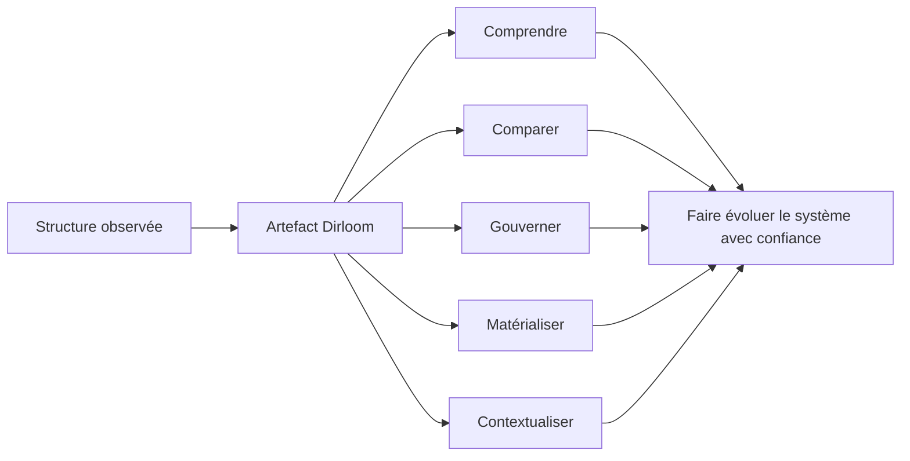
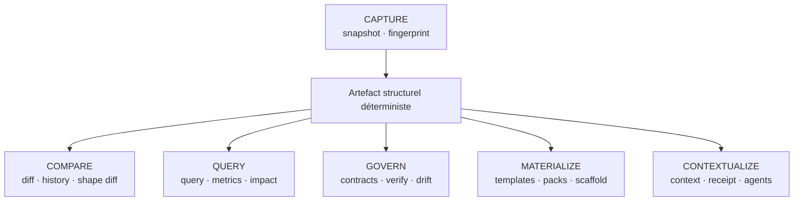
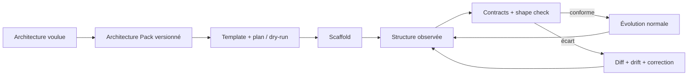

# Vision et stratégie produit

> **Statut :** direction de référence<br>
> **Horizon :** post-v0.1 jusqu'au produit mature<br>
> **Langue produit actuelle :** CLI et documentation publique en anglais ; documents de conception en français

## La vision en une phrase

> **Dirloom apporte l'intelligence structurelle aux systèmes logiciels.**

Dirloom part d'une idée simple : la structure d'un projet n'est pas un décor autour du code. Elle exprime des frontières, des conventions, des responsabilités, une histoire et une intention d'architecture. Pourtant, elle reste souvent enfermée dans le filesystem, inspectée à l'œil, documentée à la main et gouvernée par des conventions que personne ne peut vérifier durablement.

Dirloom transforme cette structure en un artefact de premier ordre : reproductible, versionnable, interrogeable, gouvernable et matérialisable. Le même artefact sert les humains, les scripts, la CI, les interfaces interactives et les agents de code.



## Le problème

Les équipes savent versionner le code, tester le comportement et observer le runtime. Elles disposent de beaucoup moins d'outils cohérents pour répondre à des questions structurelles pourtant courantes :

- À quoi ressemble réellement ce projet, sans bruit ni retraitement manuel ?
- Qu'est-ce qui a changé dans son architecture visible ?
- Ces modules suivent-ils encore la même forme ?
- Cette structure respecte-t-elle les règles de l'équipe ?
- Comment générer un nouveau module conforme sans recopier un exemple devenu obsolète ?
- Quel serait l'impact d'un déplacement avant de toucher au filesystem ?
- Quel contexte structurel un agent a-t-il reçu, et ce contexte est-il encore valide ?
- L'architecture observée correspond-elle toujours à l'architecture voulue ?

Aujourd'hui, ces réponses sont dispersées entre commandes filesystem, scripts maison, générateurs, linters propres à un langage, documents d'architecture et outils de contexte IA. Le coût n'est pas seulement du temps : il produit des architectures qui divergent silencieusement et une connaissance tribale difficile à transmettre.

## La thèse produit

> **Si la structure est capturée sous une forme déterministe, toutes les opérations suivantes peuvent partager la même vérité.**

Le déterminisme de `v0.1` n'est donc pas une optimisation prématurée. Il rend possibles le fingerprint, les snapshots, le diff, la vérification, l'historique, les contrats, la détection de dérive et les reçus de contexte. La valeur de Dirloom ne vient pas d'une collection de commandes indépendantes, mais de leur cohérence autour d'une primitive commune.



## Les utilisateurs prioritaires

### 1. Le développeur qui maintient ses propres architectures

Il travaille sur plusieurs stacks et décline une même philosophie d'organisation selon Flutter, Next.js ou Hono.js. Il veut encoder son architecture une fois, générer des modules conformes, comparer leurs formes et voir immédiatement lorsqu'une variante dérive.

**Résultat recherché :** passer d'une convention personnelle mémorisée à un système d'architecture exécutable et versionné.

### 2. L'équipe qui veut gouverner sans imposer un framework

Elle maintient un monorepo, plusieurs services ou un écosystème de plugins. Les règles portent d'abord sur les dossiers et les fichiers, puis éventuellement sur les dépendances. Elle veut des contrôles compréhensibles, language-agnostic et utilisables en CI.

**Résultat recherché :** détecter et corriger la dérive avant qu'elle ne devienne une migration.

### 3. Le contributeur qui découvre un codebase

Il doit comprendre rapidement les zones importantes, les formes dominantes, les propriétaires, les anomalies et les changements récents sans ouvrir chaque fichier.

**Résultat recherché :** obtenir une carte progressive du système plutôt qu'une liste exhaustive sans hiérarchie.

### 4. L'agent de code et son opérateur

L'agent a besoin d'un contexte limité, justifié et vérifiable. L'opérateur doit savoir ce qui a été inclus, ce qui a été exclu et si la sélection est devenue obsolète.

**Résultat recherché :** fournir moins de contexte, mais un contexte mieux structuré et traçable.

### 5. L'architecte ou le tech lead

Il veut comparer l'intention et la réalité, estimer le rayon d'impact d'une évolution et simuler une réorganisation avant de la lancer.

**Résultat recherché :** prendre des décisions d'architecture étayées par l'état observé du système.

## Les six verbes fondamentaux

| Verbe | Promesse | Capacités emblématiques |
| --- | --- | --- |
| **Capturer** | Rendre la structure reproductible | inspect, fingerprint, snapshot |
| **Comparer** | Rendre son évolution explicite | diff, history, shape compare |
| **Interroger** | Transformer l'arbre en information | query, metrics, impact |
| **Gouverner** | Faire respecter l'intention | contracts, verify, drift, reconcile |
| **Matérialiser** | Produire et faire évoluer une structure conforme | scaffold, templates, Architecture Packs, migrations |
| **Contextualiser** | Servir le bon niveau de structure | context budget, receipt, MCP, skills |

Ces verbes constituent le modèle mental stable du produit. Les commandes exactes peuvent évoluer ; le parcours utilisateur doit rester lisible à travers eux.

## Les huit piliers

### I. Structural Artifact & Presentation

Dirloom capture une structure déterministe et la projette vers des rendus humains ou machines sans confondre artefact canonique et présentation.

### II. Interactive Surfaces

Dirloom rend l'artefact navigable dans `dirloom browse`, puis dans Desktop, tout en conservant un core headless commun.

### III. Structural Version Control

Dirloom rend la structure versionnable : fingerprint, snapshot, verify, diff, historique, détection de déplacements et flux d'événements.

### IV. Architecture Generation

Dirloom rend l'architecture exécutable : scaffold, templates, Architecture Packs, capture de templates, migrations et registry.

### V. Structural Intelligence

Dirloom rend la structure interrogeable : query, métriques, Shape Signatures, dépendances, impact et simulation.

### VI. Architecture Governance

Dirloom rend l'intention contrôlable : contracts, severities, explain, drift, annotations persistantes, conformance et reconciliation.

### VII. Agent Context Infrastructure

Dirloom rend la structure exploitable par les agents : compression déterministe, compilation orientée tâche, Context Receipts, divulgation progressive, MCP, skills et Context Firewall.

### VIII. Multi-repository & System Topology

Dirloom étend progressivement son domaine aux workspaces, dépendances cross-repo, services, conteneurs, infrastructure, runtime et Architecture Twin.

## Positionnement

Dirloom n'a pas vocation à devenir « un meilleur `tree` », ni un explorateur de fichiers généraliste. Sa catégorie cible est :

> **Structural intelligence for software systems.**

La différenciation repose sur la combinaison suivante :

```text
local-first
+ deterministic core
+ language-agnostic structure
+ one versioned artifact
+ read, compare, govern and materialize loops
+ human and agent surfaces
```

Des outils adjacents démontrent séparément la valeur du contexte de repository, du packaging pour LLM, des règles d'architecture ou du scaffolding. Dirloom ne gagne pas en reproduisant chaque outil de façon isolée. Il gagne si la capture, la génération, la conformité, la dérive, l'impact et le contexte parlent tous de la même structure.

## Une boucle produit complète

Le scaffolding n'est plus considéré comme une simple opération inverse limitée aux dossiers. Dirloom assume l'ambition de devenir un générateur d'architecture complet, capable à terme de rivaliser avec les générateurs établis sur les cas structurants, tout en ajoutant ce qu'ils traitent rarement comme une boucle unifiée : conformité, comparaison de forme, versionnement et dérive.



Le premier Architecture Pack supporté à 100 % sera `reference-fsd`, identifiant provisoire de l'architecture FSD-like déjà utilisée par l'auteur dans ses variantes Flutter, Next.js et Hono.js. Son nom public reste à choisir. Le produit doit d'abord prouver une boucle exceptionnelle sur ce cas réel avant d'élargir son catalogue.

## Surfaces du produit

| Surface | Rôle | Règle |
| --- | --- | --- |
| CLI | Contrat scriptable et composable | Reste la référence fonctionnelle |
| TUI `browse` | Explorer et composer interactivement | Manipule l'artefact, pas les fichiers comme un file manager |
| Dirloom Desktop | Analyser, concevoir, comparer et simuler visuellement | Réutilise le cœur et les contrats ; aucune logique divergente |
| CI | Vérifier snapshots et contrats | Sorties stables, codes explicites, rapports exportables |
| Skills d'agents | Encapsuler des workflows sûrs | Provider-agnostic et fondés sur les commandes publiques |
| MCP | Exposer l'intelligence structurelle | Canal de distribution, pas proposition de valeur autonome |
| Mermaid / Graphviz / D2 | Exporter des vues portables | Aucun format ne devient le modèle source |

## Ce que Dirloom ne devient pas

- un gestionnaire de fichiers avec `rm`, `mv` ou éditeur généraliste ;
- un produit qui exige un LLM pour analyser une structure ;
- un service cloud obligatoire ou une plateforme de comptes ;
- un analyseur de code mono-langage déguisé en cœur universel ;
- un score magique qui réduit la qualité architecturale à un nombre opaque ;
- un standard d'écosystème proclamé avant que le format ait prouvé son utilité.

`scaffold` constitue l'exception mutante assumée. Cette exception ne banalise pas l'écriture : elle impose un plan, une portée claire, une gestion des conflits, une validation et des permissions proportionnées au pouvoir du template et de son Architecture Pack.

## Évolution de la promesse

| Maturité | Tagline | Ce qu'elle signale |
| --- | --- | --- |
| `v0.x` | **Clean project trees for humans and AI.** | Qualité du socle d'inspection et d'export |
| Produit intermédiaire | **Understand, verify and evolve your project structure.** | Versionnement, intelligence et gouvernance |
| Vision mature | **Structural intelligence for software systems.** | Architecture observée et voulue à l'échelle du système |

## Comment mesurer le progrès

Le produit ne doit pas être piloté par le nombre de commandes. La roadmap votée regroupe les North Star Metrics en six familles :

| Famille | Signaux prioritaires |
| --- | --- |
| Adoption | installations, repositories actifs, utilisateurs hebdomadaires, plateformes |
| Retention | `.dirloom.yaml`, snapshots, contracts actifs, packs installés, CI |
| Generation | scaffolds, dry-runs, conformance plans, migrations |
| Intelligence | diffs, queries, drift checks, analyses d'impact |
| Agents | contextes compilés, receipts, appels MCP, skills activés |
| Ecosystem | thèmes, packs communautaires, analyzers, templates, contributeurs |

Ces indicateurs ne justifient aucune télémétrie invasive. Ils peuvent provenir de mécanismes publics, volontaires ou des plateformes de distribution.

## Les trois paris différenciants

1. **Architecture Packs** — rendre une architecture installable, générative, vérifiable, documentée et utilisable par un agent.
2. **Context Receipts** — rendre les décisions d'un agent reproductibles en versionnant le contexte exact reçu.
3. **Architecture Twin** — maintenir l'architecture voulue et observée, mesurer leur divergence et simuler leur évolution.

Le pari commun est qu'une équipe gagne énormément lorsque toutes ces opérations reposent sur une même représentation déterministe, locale et portable. Dirloom devient alors le fil continu entre l'architecture voulue, créée, observée et transmise aux agents.
